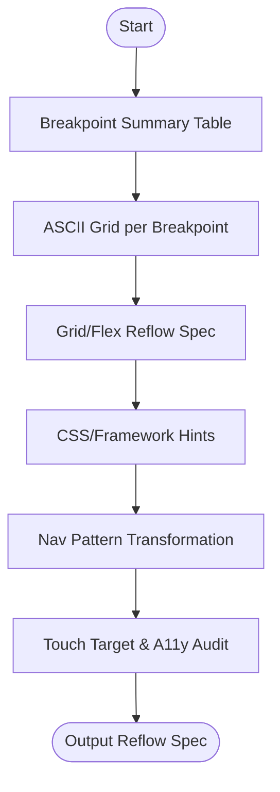

# Skill: Responsive Layout Planning

## Purpose
Produces structured reflow specifications detailing element adaptation across device breakpoints.

## Input
| Variable | Type | Required | Description |
|----------|------|----------|-------------|
| `{{screen_name}}` | string | yes | Screen/component name |
| `{{current_layout}}` | string | yes | Desktop layout description |
| `{{framework}}` | string | yes | CSS framework/approach |
| `{{breakpoints}}` | string | yes | Target breakpoints |
| `{{priority}}` | string | yes | Layout priority (e.g., "mobile-first") |

## Prompt
- **Breakpoint Summary**: Table (Breakpoint, Width, Primary Shift).
- **ASCII Grids**: Draw ASCII grid per breakpoint showing zones, columns, and `[HIDDEN]` elements.
- **Reflow Spec**: List grid/flex changes, visibility, and spacing for each breakpoint.
- **CSS Hints**: Framework-specific implementation (Tailwind classes, media queries).
- **Navigation Transformation**: Pattern changes (e.g., Menu → Drawer).
- **Accessibility**: Mobile touch target audit (≥44×44px) and focus order implications.

## Rules
- Use WCAG 2.5.5 size targets.
- Normalize breakpoints to match `{{priority}}`.
- No filler text.

## Edge Cases
| Case | Strategy |
|------|----------|
| Nav Overload | If >5 mobile nav items, recommend overflow/drawer. |
| Fixed Pixels | Instruct conversion to fluid/max-width first. |
| custom breakpoints | Generate `theme.extend.screens` config for Tailwind. |

## Output Format
- Six sections (`##`).
- Tables for summary and a11y audit.
- ASCII grids for visual reflow.

## MCP Tools
| Tool | Server | Use Case |
|------|--------|----------|
| Figma | `figma-mcp` | Create responsive frames with auto-layout. |

## Senior Review Checklist
- [ ] Simplest reflow strategy?
- [ ] Mobile-first/Desktop-first consistency?
- [ ] Touch targets ≥ 44px?
- [ ] Navigation patterns are platform-appropriate?

## Changelog
| Version | Date | Description |
|---------|------|-------------|
| 1.1.0 | 2026-03-20 | Condensed format. |
| 1.0.0 | 2026-03-20 | Initial release. |

## Mermaid Diagram

