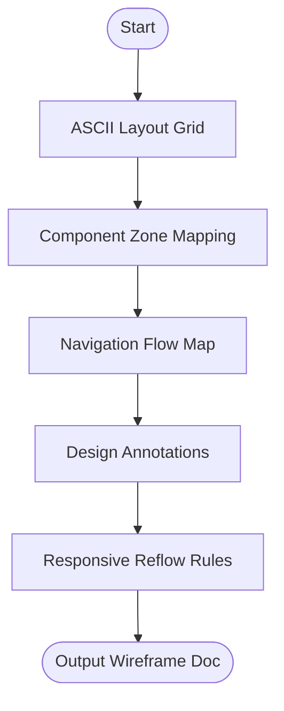

# Skill: Screen Wireframe Generation

## Purpose
Produces structured ASCII wireframes defining layout, components, and navigation for low-fidelity blueprints.

## Input
| Variable | Type | Required | Description |
|----------|------|----------|-------------|
| `{{screen_name}}` | string | yes | Screen name/identifier |
| `{{screen_purpose}}` | string | yes | 1–2 sentence purpose |
| `{{layout_type}}` | string | yes | Layout pattern (e.g., "dashboard") |
| `{{components}}` | string | no | Comma-separated components |

## Prompt
- **Layout Grid**: ASCII grid using box-drawing characters showing zones (HEADER, SIDEBAR, CONTENT).
- **Component Placement**: List components with zone, position, and behavior notes.
- **Navigation Flow**: Map actions (Trigger, Destination, Transition).
- **Annotations**: Numbered list explaining key design decisions.
- **Responsive Adaptation**: Rules for Mobile (<768px) and Tablet (768px–1024px).

## Rules
- Match grid proportions to `{{layout_type}}`.
- No metric/feature invention.
- No filler text.

## Edge Cases
| Case | Strategy |
|------|----------|
| No Components | Infer standard components for `{{layout_type}}`. |
| High Complexity | If >15 components, group logically and recommend splitting. |
| Platform Mismatch | Annotate mobile-appropriate recommendations for desktop layouts. |

## Output Format
- Five sections (`##`).
- ASCII grid for layout.
- Bulleted lists for components and flow.

## MCP Tools
| Tool | Server | Use Case |
|------|--------|----------|
| Figma | `figma-mcp` | Create actual frames for handoff. |
| Excalidraw | `excalidraw-mcp` | Generate hand-drawn style sketches. |

## Senior Review Checklist
- [ ] Simplest possible layout?
- [ ] Zone clarity in ASCII grid?
- [ ] Navigation triggers clearly defined?
- [ ] Responsive rules feasible for developers?

## Changelog
| Version | Date | Description |
|---------|------|-------------|
| 1.1.0 | 2026-03-20 | Condensed format. |
| 1.0.0 | 2026-03-20 | Initial release. |

## Mermaid Diagram

