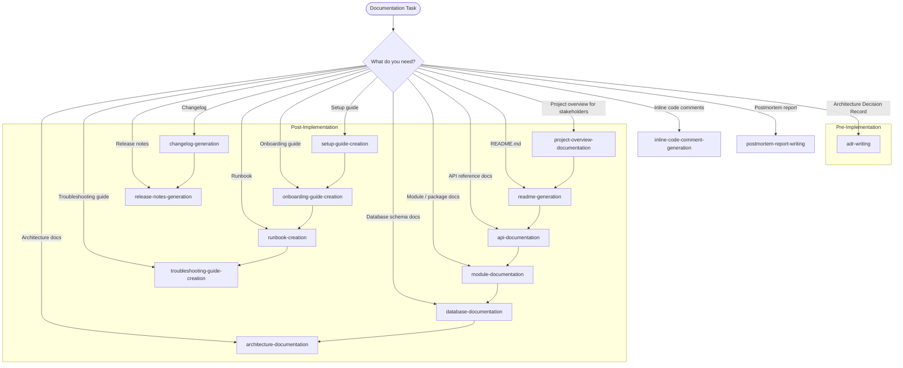

# Skills: Documentation (15 skills)

This category contains skills for writing technical documentation.

## Subdirectory Structure

Each skill in the `documentation` category has the following structure:

```
{skill-name}/
├── SKILL.md          # Core instructions (≤500 lines)
├── references/       # Supporting technical documentation
│   ├── README.md
│   └── compatibility-matrix.md
├── assets/           # Technical document templates
│   └── template.md
└── examples/         # Concrete input/output examples
    ├── input.md
    └── output.md
```

## Skills

| Skill | Description |
|-------|-------------|
| `adr-writing` | Write Architecture Decision Records |
| `api-documentation` | Document APIs (OpenAPI-compatible) |
| `architecture-documentation` | Document system architecture |
| `changelog-generation` | Generate changelogs |
| `database-documentation` | Document database schemas |
| `inline-code-comment-generation` | Generate inline code comments |
| `module-documentation` | Document code modules/packages |
| `onboarding-guide-creation` | Create onboarding guides |
| `postmortem-report-writing` | Write postmortem reports |
| `project-overview-documentation` | Document project overviews |
| `readme-generation` | Generate README.md files |
| `release-notes-generation` | Generate release notes |
| `runbook-creation` | Create operational runbooks |
| `setup-guide-creation` | Create setup guides |
| `troubleshooting-guide-creation` | Create troubleshooting guides |

---

## Mermaid Diagram


