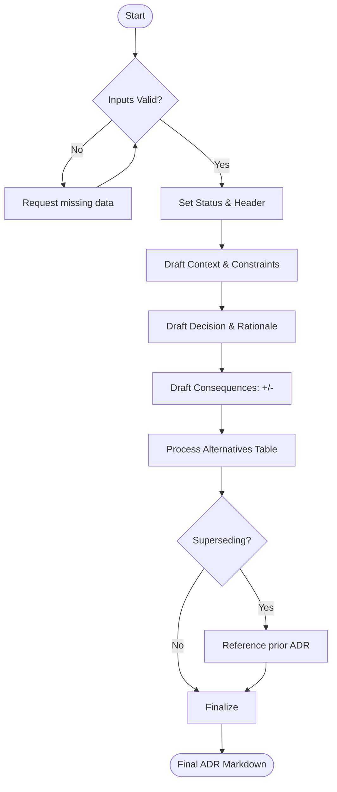

# Agent Optimized: ADR Writing

## Directives
- **Format**: Use MADR/Nygard standard.
- **Sections**:
    - **Header**: `# {{decision_title}}`, ISO date, Status (Proposed|Accepted|Deprecated|Superseded).
    - **Context**: Problem statement, constraints (cost/scale), and assumptions.
    - **Decision**: Chosen option, rationale, and accepted trade-offs.
    - **Consequences**: Categorized lists (Positive, Negative, Neutral).
    - **Alternatives**: Table or list of rejected options with specific reasons.
- **Traceability**: If superseding, reference the prior ADR ID in Context.
- **Precision**: Do not invent context or rejection rationale. Ask for missing details.

## Logic Flow

## Constraints
| Rule | Description |
|------|-------------|
| Title | Short, imperative, prefixed with "ADR-XXX:" if applicable. |
| Consequences | Surface tension/conflicts in "Negative Consequences". |
| Status | Default to "Proposed" unless explicit confirmation of acceptance. |
| Scope | Technical architecture decisions only. |

## Review Criteria
- [ ] Rationale for rejection of alternatives is clear.
- [ ] All primary constraints are addressed in context.
- [ ] Trade-offs are explicitly acknowledged.
- [ ] Output is prose for context/decision and bullets for consequences.

## Metadata
- **Output Path**: `.agents/documents/decisions/`
- **Changelog**: 1.1.0 (MADR alignment, added metadata); 1.0.0 (Initial).
