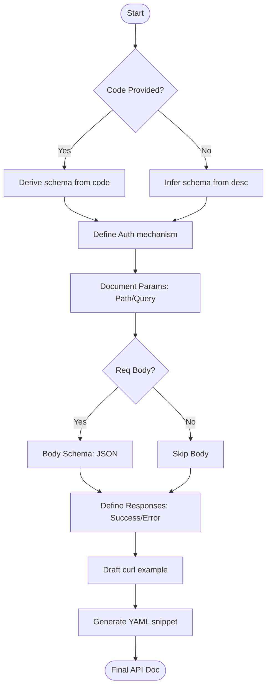

# Agent Optimized: API Documentation

## Directives
- **Source Analysis**: Use `{{existing_code}}` to derive schemas; otherwise, infer from `{{endpoint_description}}`.
- **Content Sections**:
    - **Overview**: Method, path, summary, side effects.
    - **Auth**: Requirement, mechanism, location, scopes. Default to "Bearer JWT".
    - **Params**: Tables for Path and Query params (Name, Type, Req, Default, Desc, Example).
    - **Body**: Content type, JSON Schema (fields, types, validation).
    - **Responses**: Success (2xx) and Error (4xx/5xx) schemas + examples.
    - **Usage**: Runnable `curl` command + success body.
    - **OpenAPI**: Valid OpenAPI 3.0 YAML snippet.
- **Precision**: Use realistic example values. Preserved version prefixes in paths.

## Logic Flow

## Constraints
| Rule | Description |
|------|-------------|
| Formatting | Use 8 standard headers (`##`); Tables for all schemas. |
| YAML | Snip must be valid OpenAPI 3.0; include `security` definitions. |
| File Uploads | Use `multipart/form-data` and document metadata fields. |
| Multi-Success | Document each distinct success response variant separately. |

## Review Criteria
- [ ] Error response codes have realistic examples.
- [ ] YAML snippet passes validation.
- [ ] Parameter constraints (min/max, regex) are captured.
- [ ] `curl` example uses valid CLI syntax.

## Metadata
- **Output Path**: `.agents/documents/application/api/{module-slug}/`
- **Changelog**: 1.1.0 (Refined content sections, added metadata); 1.0.0 (Initial).
