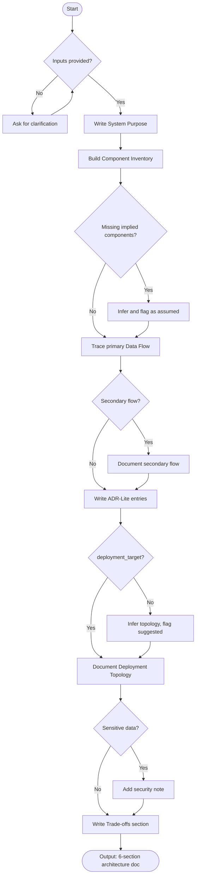

# Agent Optimized: Architecture Documentation

## Directives
- **System Purpose**: Describe problem solved, primary users, and scope boundaries.
- **Component Inventory**: Provide Table (Name, Role, Technology, Interaction).
- **Data Flow**: Numbered sequence (min 6 steps) tracing a representative user request.
- **ADR-Lite**: Include min 4 entries (Decision, Context, Rationale, Trade-off).
- **Deployment Topology**: Detail packaging, network boundaries, scaling, and environment separation.
- **Trade-offs**: List min 4 limitations with impact and mitigation.

## Constraints
- **Inference**: Derive components from inputs; do not invent unimplied components.
- **Assumptions**: Infer topology if missing from `{{deployment_target}}` and flag as "Suggested Baseline".
- **Clarification**: Request input if `{{system_name}}`, `{{system_description}}`, or `{{tech_stack}}` are contradictory.

## Strategy: Edge Cases
| Case | Strategy |
|------|----------|
| Minimal stack | Infer MV components, flag as assumed, ask for confirmation. |
| Monolithic system | Document internal modules as components; note scaling limitations. |
| Sensitive data | Add security note (encryption, access control) in deployment topology. |

## Format
- Six sections with markdown headers (`##`).
- Table for Component Inventory.
- Numbered list for Data Flow.
- Bold field labels for ADR-Lite.
- Word Count: 800–1,400 words.

## Verification: Senior Review
- [ ] Component Inventory covers all tech stack items?
- [ ] Data Flow traces realistic end-to-end path (min 6 steps)?
- [ ] ADR-Lite entries name considered alternatives?
- [ ] Deployment Topology addresses scaling/networking?

## Metadata
- **Path**: `.agents/documents/design/architecture/`
- **Mermaid**:

