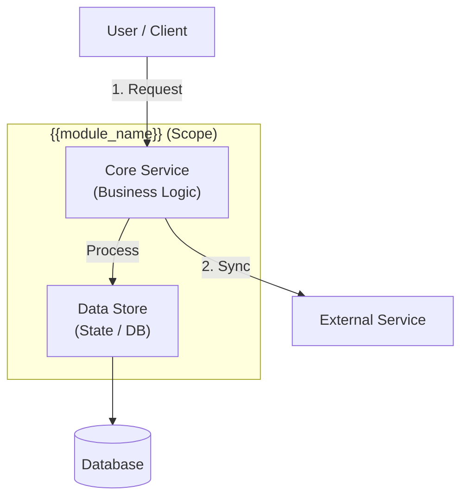

# Module Overview: {{module_name}}

> Halaman utama untuk modul {{module_name}}. Berisi ringkasan dan daftar fitur.

---

## Navigation
- [API Specification](../api-documentation/)
- [Test Scenarios](../testing/qa-design/)

---

## 1. Module Introduction

### 1.1 Description
{{module_description}}

### 1.2 Position & Role
- **Type:** {{Core | Support | Optional}}
- **Business Value:** {{business_value}}

---

## 2. Feature List

| Feature | Description | Status |
|---------|-------------|--------|
| **{{feature_1}}** | {{description_1}} | {{Todo | In Progress | Done}} |
| **{{feature_2}}** | {{description_2}} | {{Todo | In Progress | Done}} |

---

## 3. High-Level Architecture

---

## 4. Dependencies

- **Database:** {{db_tables}}
- **External Services:** {{external_services}}
- **Internal Modules:** {{internal_dependencies}}

---

## 5. Implementation Tasks Summary

| Task ID | Component | Status | Description |
|---------|-----------|--------|-------------|
| {{MOD}}-BE-01 | Migration | Todo | {{description}} |
| {{MOD}}-BE-02 | Model | Todo | {{description}} |
| {{MOD}}-BE-03 | Service | Todo | {{description}} |
| {{MOD}}-BE-04 | Controller | Todo | {{description}} |
| {{MOD}}-BE-05 | Tests | Todo | {{description}} |
