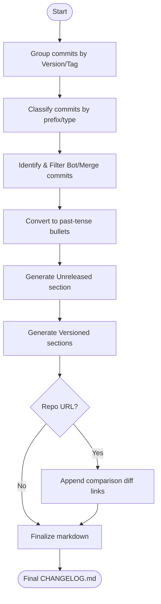

# Agent Optimized: Changelog Generation

## Directives
- **Format**: Strictly follow "Keep a Changelog" (GFM).
- **Structure**:
    - **Header**: Standard intro and SEMVER statement.
    - **Sections**: `## [Unreleased]` followed by versioned blocks `## [X.Y.Z] - YYYY-MM-DD`.
    - **Order**: Reverse chronological.
    - **Categories**: Added, Changed, Deprecated, Removed, Fixed, Security.
- **Categorization Logic**:
    - `feat:`/`add` -> **Added**
    - `fix:`/`bug` -> **Fixed**
    - `chore:`/`refactor:`/`perf:`/`update` -> **Changed**
    - `security:`/`cve` -> **Security**
    - `deprecate:`/`remove:` -> **Deprecated/Removed**
- **Content**: Concise past-tense bullets. Exclude SHAs and PR numbers.
- **Diff Links**: If `{{repo_url}}` provided, append comparison links at EOF.

## Logic Flow

## Constraints
| Rule | Description |
|------|-------------|
| Formatting | Use bold category headers (`### Added`). |
| Dates | Use `YYYY-MM-DD`. Use placeholders if dates are missing. |
| Versions | Default to `{{current_version}}` if no tags found in log. |
| Scope | Changelog transformation only; do not generate commit messages. |

## Review Criteria
- [ ] No raw SHAs/PR numbers in bullets.
- [ ] All commits categorized correctly per logic.
- [ ] Comparison links valid for the repo structure.
- [ ] Header/Introduction matches standard spec.

## Metadata
- **Output Path**: `.agents/documents/operations/changelogs/`
- **Changelog**: 1.1.0 (Added metadata, refined categorization); 1.0.0 (Initial).
