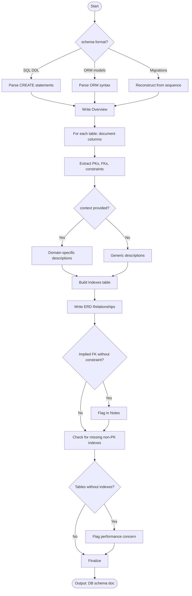

# Agent Optimized: Database Documentation

## Directives
- **Overview**: Summarize database purpose, table count, and primary entities.
- **Tables**: Document Purpose, Columns (Type, Nullable, Default, Description), PKs, FKs, and Constraints.
- **Indexes**: Provide Table (Index Name, Table, Columns, Type, Purpose).
- **ERD Summary**: Plain text relationships using `TableA (cardinality) TableB` notation.
- **Notes/Warnings**: Flag performance issues, nullable FKs, or non-nullable columns without defaults.

## Constraints
- **Scope**: Use `{{schema_source}}` and `{{database_type}}` for analysis.
- **Assumptions**: State assumptions clearly if schema is ambiguous.
- **Naming**: Junction tables must be explicitly named.

## Strategy: Edge Cases
| Case | Strategy |
|------|----------|
| No foreign keys | Flag inferred relationships lacking explicit FK constraints. |
| ORM input | Parse ORM syntax (Prisma, SQLAlchemy); note framework behavior. |
| Large schema (20+) | Prepend a Table Index with one-line descriptions. |
| Ambiguous types | Document declared affinity; note dynamic typing behavior. |

## Format
- Markdown headers (`##`, `###`).
- Tables for columns and indexes.
- Relationship notation: `(1) ←→ (N)`.
- Word Count: 300–1,500 words.

## Verification: Senior Review
- [ ] Columns table includes data types and nullability?
- [ ] All foreign key relationships identified (explicit or implied)?
- [ ] Primary keys and unique constraints marked?
- [ ] Performance-critical indexes documented?

## Metadata
- **Path**: `.agents/documents/design/database/`
- **Mermaid**:

