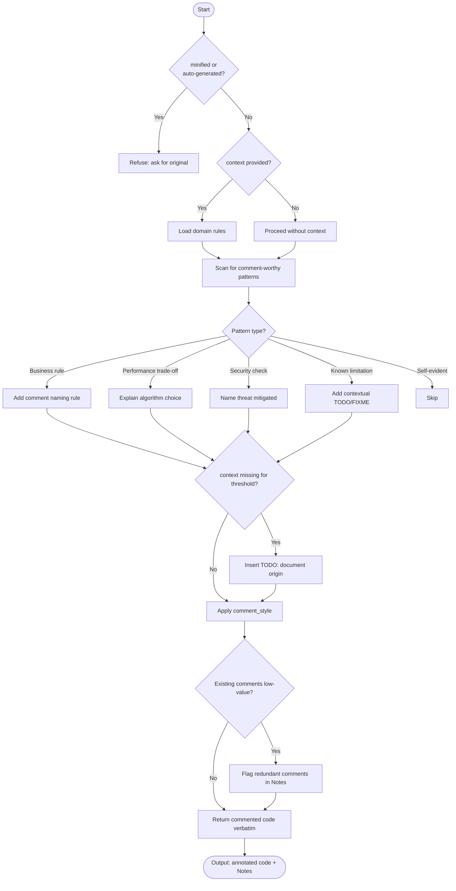

# Agent Optimized: Inline Code Comment Generation

## Directives
- **Reasoning over Description**: Comment the "why", not the "what".
- **Business Logic**: Name rules and rationale for constants/thresholds.
- **Performance**: Explain trade-offs for algorithms or data structures.
- **Security**: Detail mitigated threats or invariants for auth/PII.
- **Markers**: Add `TODO`/`FIXME` with context and deferral reason.
- **Preservation**: Return full snippet verbatim with comments inserted; no refactoring.

## Constraints
- **Style**: Apply `{{comment_style}}` (e.g., JSDoc, PEP 8) consistently.
- **Filtering**: Skip standard library calls, simple getters, and descriptive declarations.
- **Language**: Use `{{tech_stack}}` appropriate syntax.

## Strategy: Edge Cases
| Case | Strategy |
|------|----------|
| Over-commented | Flag redundant comments for removal in Notes. |
| Missing context | Insert `// TODO: document origin` for magic numbers. |
| Minified/Generated | Refuse and request original source. |
| Mixed styles | Apply requested style; note inconsistencies in existing code. |

## Format
- Original code block verbatim with inline comments.
- Specified comment syntax only.
- Optional "Notes" list following the code block.

## Verification: Senior Review
- [ ] Reasoning explained for non-obvious blocks?
- [ ] Magic numbers have named rules/rationale?
- [ ] Algorithm trade-offs documented?
- [ ] Verification: Verbatim code preserved?

## Metadata
- **Path**: `.agents/documents/application/modules/{module-slug}/`
- **Mermaid**:

