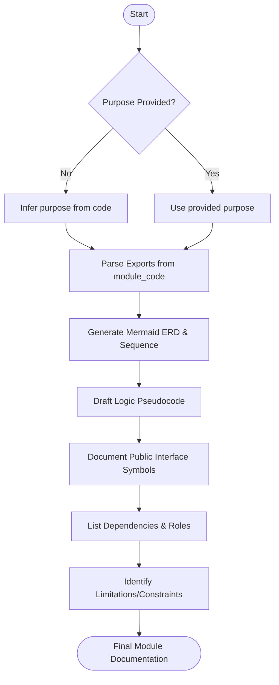

# Agent Optimized: Module Documentation

## Directives
- **Content Sections**:
    1. **Overview**: Purpose, architectural role, and problem solved.
    2. **Data Model**: Mermaid ERD for owned/used entities.
    3. **Business Logic**: Structured pseudocode for complex operations.
    4. **Sequence Diagram**: Mermaid for multi-actor/component flows.
    5. **Public Interface**: Document every exported symbol (Signature, Return, Params Table, Throws).
    6. **Dependencies**: Table of internal/external deps and their roles.
    7. **Limitations**: Constraints, edge cases, and workarounds.
- **Source Analysis**: Extract symbols and types directly from `{{module_code}}`.
- **Interface Grouping**: Use `### Functions`, `### Classes`, `### Types/Interfaces`.
- **Pseudocode Rule**: Use pseudocode only for logic; NO verbatim code snippets.

## Logic Flow

## Constraints
| Rule | Description |
|------|-------------|
| Precision | Signature/Return types must match source code exactly. |
| Deprecation | Mark deprecated symbols; list specific replacements. |
| Initialization | Flag circular dependencies as risk factors. |
| Tone | Concise, technical, and consumer-focused. |

## Review Criteria
- [ ] Every exported symbol is documented.
- [ ] Parameter tables include validation rules/constraints.
- [ ] External dependencies are explicitly listed.
- [ ] Mermaid diagrams reflect current architectural logic.

## Metadata
- **Output Path**: `.agents/documents/application/modules/{module-slug}/`
- **Changelog**: 1.2.0 (Added Diagrams/Pseudocode); 1.1.0 (Added metadata); 1.0.0 (Initial).
