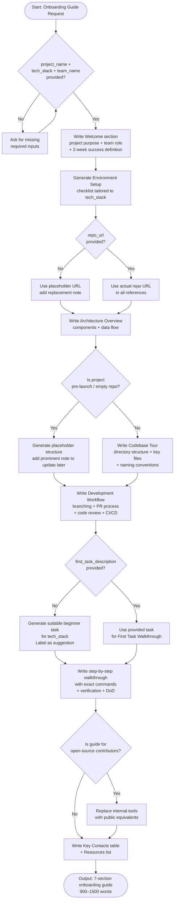

# Agent Optimized: Onboarding Guide Creation

## Directives
- **Welcome**: Outline project impact, system integration, and 2-week success metrics.
- **Setup**: Provide Checklist (8-12 items) for tools/access tailored to `{{tech_stack}}`.
- **Architecture**: List 4-8 Key Components and trace primary Data Flow (6-10 steps).
- **Tour**: Detail Directory Tree, 5-8 Key Files, and Naming Conventions.
- **Workflow**: Specify Branching, PR Process, Review Standards, and CI/CD.
- **First Task**: Walkthrough Goal, Files to change, Commands, and DoD.
- **Contacts**: Provide Table (Key Contacts) and list 6-10 essential Resource links.

## Constraints
- **Missing URL**: If `{{repo_url}}` is missing, use `https://github.com/your-org/{{project_name}}`.
- **Missing Task**: If `{{first_task_description}}` is missing, generate a stack-appropriate beginner task.
- **Tone**: Professional, encouraging, and clear.

## Strategy: Edge Cases
| Case | Strategy |
|------|----------|
| Pre-launch/Empty | Generate placeholder tour; note to update later. |
| Large monorepo | Scope tour to relevant subdirectory. |
| Remote/Async | Include async communication guidance and documentation norms. |
| Open-source | Replace internal tools with public equivalents. |

## Format
- Seven numbered sections (`##`) separated by `---`.
- Markdown tables and checklists (`- [ ]`).
- Code commands in fenced blocks.
- Word Count: 900–1,500 words.

## Verification: Senior Review
- [ ] Welcome section defines success for the first 2 weeks?
- [ ] Architecture overview includes both components and flow?
- [ ] First task is atomic and verifiable?
- [ ] Repo URLs are consistent throughout?

## Metadata
- **Path**: `.agents/documents/operations/runbooks/`
- **Mermaid**:

