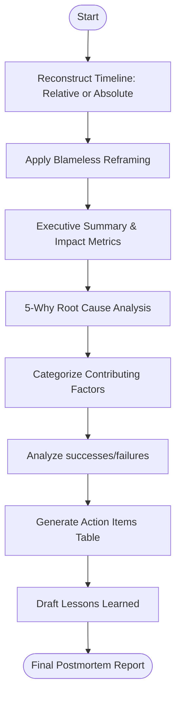

# Agent Optimized: Postmortem Report Writing

## Directives
- **Tone**: Strictly blameless; focus on systemic gaps, process failures, and tooling deficiencies.
- **Content Sections**:
    1. **Summary**: 3–5 sentence executive brief.
    2. **Impact**: Users affected, Duration, Error rate, SLA/Revenue impact.
    3. **Timeline**: Chronological `[TIMESTAMP] — [EVENT]` (Detection -> Mitigation).
    4. **Root Cause**: Results of 5-Why analysis.
    5. **Contributing Factors**: People, Process, Tooling, Architecture.
    6. **Analysis**: "What Went Well" vs "What Went Wrong" (systemic focus).
    7. **Action Items**: Table (Action, Owner, Priority, Due Date) - min 4 items.
    8. **Lessons**: Future-looking paragraphs on reliability posture.
- **Data Handling**: Use relative times (T+Xm) if timestamps are missing. Reframe any "human error" inputs into process/system gaps.

## Logic Flow

## Constraints
| Rule | Description |
|------|-------------|
| Verification | At least one action item per identified root cause and failure point. |
| Multi-service | Originating service is primary; others are contributing/impacted. |
| Uncertainty | If root cause is unknown, mark as `[REQUIRES INVESTIGATION]` and add P1 action. |
| Precision | Use exact log excerpts/metrics where available. |

## Review Criteria
- [ ] Language is blameless and systemic.
- [ ] Timeline covers from detect to resolve.
- [ ] Action items are specific and assigned.
- [ ] Executive summary is stakeholder-ready.

## Metadata
- **Output Path**: `.agents/documents/operations/runbooks/`
- **Changelog**: 1.1.0 (Refined blamelessness rules, added metadata); 1.0.0 (Initial).
