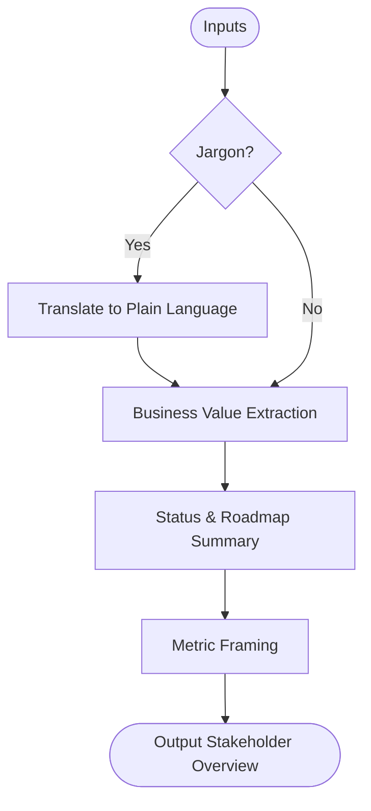

# Skill: Project Overview Documentation

## Purpose
Generates a clear, non-technical project overview document aimed at stakeholders.

## Input
| Variable | Type | Required | Description |
|----------|------|----------|-------------|
| `{{project_name}}` | string | yes | Project name |
| `{{project_description}}` | string | yes | Description of purpose/problem |
| `{{target_users}}` | string | yes | Target user roles/context |
| `{{current_status}}` | string | yes | Current phase |
| `{{tech_stack}}` | string | no | Optional tech stack list |
| `{{key_features}}` | string | no | Optional list of 3–5 key features |

## Prompt
- **Project Purpose**: Business value and reason for existence.
- **Problem Solved**: Specific gap addressed, impact, and consequences.
- **Target Users**: Primary/secondary groups and their benefits.
- **Key Features**: 3–5 plain-language points focused on user benefit.
- **Current Status**: Phase, achievements, and next steps.
- **Technology Summary**: Plain-language paragraph explaining product type.
- **Team**: Brief overview of the development team.
- **Timeline & Roadmap**: 3-point summary (Completed, In Progress, Planned).
- **Success Metrics**: 3–5 business-framed measurable indicators.

## Rules
- Avoid jargon; explain technical terms simply.
- Do not invent details, team members, or metrics.
- No filler text.

## Edge Cases
| Case | Strategy |
|------|----------|
| Missing tech stack | Describe product type from context. |
| Pre-launch/no users | Frame metrics and status as targets/intentions. |
| Technical desc | Translate all jargon into business language. |

## Output Format
- Nine sections (`##`).
- Prose paragraphs or structured bullet lists.

## Senior Review Checklist
- [ ] Simplest possible explanation for stakeholders?
- [ ] Business value clearly articulated?
- [ ] No jargon/unexplained technical terms?
- [ ] Success metrics are meaningful to non-engineers?

## Changelog
| Version | Date | Description |
|---------|------|-------------|
| 1.1.0 | 2026-03-20 | Condensed format. |
| 1.0.0 | 2026-03-20 | Initial release. |

## Output Path
`.agents/documents/application/modules/{module-slug}/`

## Mermaid Diagram

