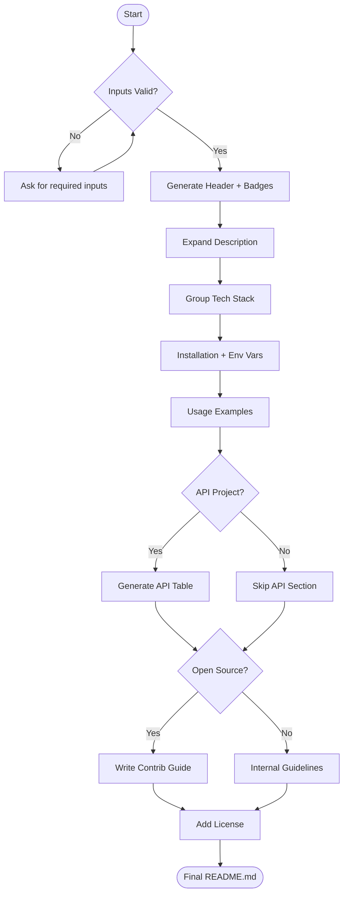

# Agent Optimized: Readme Generation

## Directives
- **Structure**: Use H1 for project name, H2 for sections. Standard GFM only.
- **Header**: Project name + Shields.io badges (build, license, tech).
- **Core Content**: 
    - Expand `{{project_description}}` (2–4 sentences) on value/problem.
    - Group **Tech Stack** by role (Runtime, Framework, DB, Testing).
    - List **Prerequisites** with version requirements.
    - Provide step-by-step **Installation** shell commands.
    - Table of **Environment Variables** (Required/Optional).
    - Minimum two runnable **Usage** examples.
- **Conditional Sections**:
    - **API Summary**: Table (Method, Path, Description, Auth) if applicable.
    - **Contributing**: Standard fork/branch/test/PR steps (Open Source) or Internal Rules (Proprietary).
- **License**: Name and one-line statement.

## Logic Flow

## Constraints
| Rule | Description |
|------|-------------|
| No Hallucination | Do not invent features, endpoints, or variables. |
| Placeholders | Use `https://github.com/your-org/{{project_name}}` if URL missing. |
| Monorepos | Generate root-level README; note sub-package requirements. |
| Tone | Professional, technical, and outcome-oriented. |

## Review Criteria
- [ ] Tech stack accuracy.
- [ ] Env vars required/optional status.
- [ ] Installation verified on clean machine.
- [ ] API summary logic applied.

## Metadata
- **Output Path**: `.agents/documents/application/modules/{module-slug}/`
- **Changelog**: 1.1.0 (Moved examples, added metadata fields); 1.0.0 (Initial).
