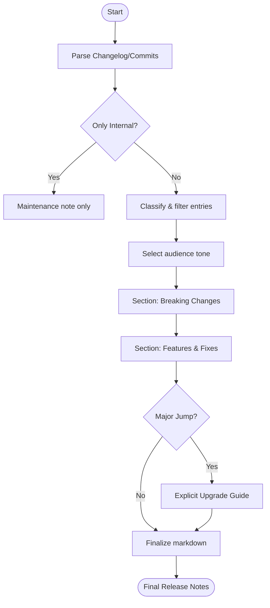

# Agent Optimized: Release Notes Generation

## Directives
- **Content Sections**:
    1. **Breaking Changes**: Change description, migration steps, urgency. (Always first).
    2. **New Features**: Lead with benefit (1–2 sentences).
    3. **Improvements**: Observable impact (low jargon).
    4. **Bug Fixes**: Resolved symptom in past tense.
    5. **Upgrade Instructions**: Numbered steps (if applicable).
- **Audience Adaptation**:
    - **End users**: Plain language, focus on capabilities.
    - **Developers**: Technical focus, API/method changes.
    - **Enterprise**: Focus on reliability, security, ops impact.
- **Formatting**: Bold short labels per bullet. Exclude internal hashes, PRs, or tickets. Omit vague commits.

## Logic Flow

## Constraints
| Rule | Description |
|------|-------------|
| Priority | Breaking changes MUST be prominent and at the top. |
| Verification | Major version jumps MUST be audited for breaking changes. |
| Precision | Exclude internal SHAs, PR numbers, or bug tracker IDs. |
| Default | Default to plain language if audience is mixed. |

## Review Criteria
- [ ] User benefits lead the feature descriptions.
- [ ] Migration path for breaking changes is explicit.
- [ ] Jargon level matches `{{audience}}`.
- [ ] Upgrade instructions are verified and step-by-step.

## Metadata
- **Output Path**: `.agents/documents/operations/changelogs/`
- **Changelog**: 1.1.0 (Added metadata, audience rules); 1.0.0 (Initial).
