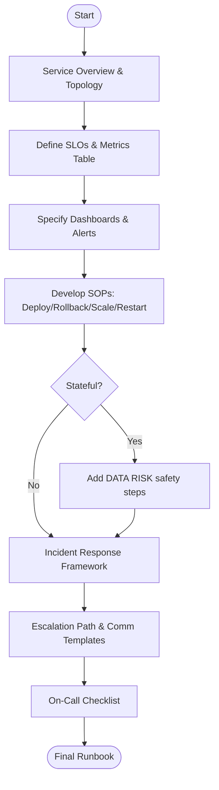

# Agent Optimized: Runbook Creation

## Directives
- **Content Sections**: Generate 7 sections separated by `---`:
    1. **Service Overview**: Purpose, dependencies, topology.
    2. **Metrics/SLOs**: Table (Metric, Target, Window, Threshold).
    3. **Dashboards**: Key panels and URL patterns.
    4. **Alerts**: Table (Name, Condition, Severity, Response) - min 6.
    5. **SOPs**: Deploy, Rollback, Scale, Restart with `{{deployment_platform}}` commands.
    6. **Incident Response**: Severity Levels (P1-P4), Escalation, Comm Templates.
    7. **Checklist**: 8-12 pre-shift tasks.
- **Platform Specificity**: Tailor commands strictly to `{{deployment_platform}}`.
- **Defaults**: Use stack-appropriate defaults if `{{slo_targets}}` or `{{on_call_team}}` are missing.
- **Safety**: For stateful services, include explicit `⚠️ DATA RISK` warnings and safety steps.

## Logic Flow

## Constraints
| Rule | Description |
|------|-------------|
| Blast Radius | Note region/environment impact for multi-region systems. |
| Clarity | SOP steps must be unambiguous and command-ready. |
| Comm Templates | Provide ready-to-use snippets for Statuspage/Slack. |
| Verification | Each SOP must include a "Verify" step. |

## Review Criteria
- [ ] Command syntax matches `{{deployment_platform}}`.
- [ ] Dependency map is complete.
- [ ] SLO targets are realistic for the tech stack.
- [ ] Data safety markers present for stateful operations.

## Metadata
- **Output Path**: `.agents/documents/operations/runbooks/`
- **Changelog**: 1.1.0 (Refined SOP requirements, added metadata); 1.0.0 (Initial).
