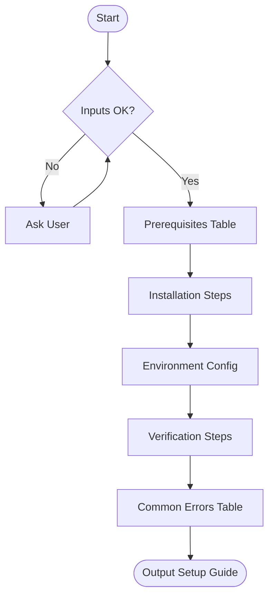

# Skill: Setup Guide Creation

## Purpose
Generates structured developer setup guides to eliminate "works on my machine" issues.

## Input
| Variable | Type | Required | Description |
|----------|------|----------|-------------|
| `{{project_name}}` | string | yes | Project or repository name |
| `{{tech_stack}}` | string | yes | Primary technologies |
| `{{os_targets}}` | string | yes | Target operating systems |
| `{{repo_url}}` | string | no | Repository URL |

## Prompt
- **Prerequisites**: Table (Tool, Min Version, Verify Command, Install Reference).
- **Installation**: Sequential steps (Clone, Install) with exact commands.
- **Configuration**: Detail environment variables (Purpose, Examples) and copy commands.
- **Verification**: Commands to start app, run tests, and check connectivity (DB/Cache).
- **Errors**: Table of ≥4 common errors (Message, Root Cause, Fix Command).

## Rules
- Inline OS-specific differences.
- Use placeholders if `{{repo_url}}` is missing.
- No conversational filler.

## Edge Cases
| Case | Strategy |
|------|----------|
| Monorepo | Clarify target services; generate per-service steps. |
| Windows | Flag WSL2 issues; provide workarounds. |
| Missing .env | List variables inline; instruct creation. |
| No repo URL | Use placeholders with substitution notes. |

## Output Format
- Five sections (`##`).
- Tables for prerequisites/variables/errors.
- Numbered lists with code blocks.

## Senior Review Checklist
- [ ] Simplest working solution?
- [ ] Failure modes (OS/Env) handled?
- [ ] Security (secrets handling) addressed?
- [ ] Verification steps included?

## Changelog
| Version | Date | Description |
|---------|------|-------------|
| 1.1.0 | 2026-03-20 | Restructured examples/references. |
| 1.0.0 | 2026-03-20 | Initial release. |

## Output Path
`.agents/documents/operations/runbooks/`

## Mermaid Diagram

