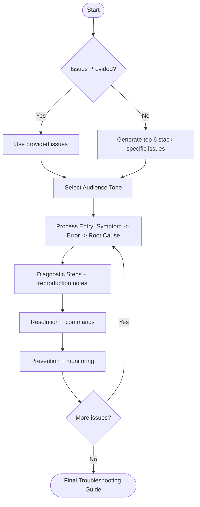

# Agent Optimized: Troubleshooting Guide Creation

## Directives
- **Content Structure**: Provide min 6 entries. Each MUST include:
    - **Symptom**: Visible observation.
    - **Error Message**: Exact log/UI text in `code blocks`.
    - **Root Cause**: 1–2 sentence technical explanation.
    - **Diagnostic Steps**: Numbered commands to confirm.
    - **Resolution**: Step-by-step fix with commands.
    - **Prevention**: Actionable monitoring/config change.
- **Audience Adaptation**: Adjust technical depth based on `{{target_audience}}`.
- **Stack Context**: If `{{known_issues}}` missing, generate top 6 common issues for `{{tech_stack}}`.
- **Observability**: Recommend missing tools if diagnosis is hindered by stack gaps.

## Logic Flow

## Constraints
| Rule | Description |
|------|-------------|
| Precision | Use exact error messages and valid command syntax. |
| Scope | Startup, runtime, performance, and configuration issues. |
| Intermittency | Explicitly note conditions required for intermittent bugs. |
| Formatting | Use horizontal rules (`---`) between entries. |

## Review Criteria
- [ ] Simplest working resolution provided.
- [ ] Diagnostic steps are verifiable.
- [ ] Prevention is actionable.
- [ ] No assumed default paths/ports without verification.

## Metadata
- **Output Path**: `.agents/documents/operations/runbooks/`
- **Changelog**: 1.1.0 (Refined structure, added metadata); 1.0.0 (Initial).
