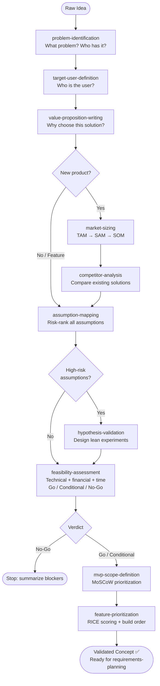

# Skills: Idea Validation (10 skills)

This category contains skills for product idea validation and market analysis.

## Subdirectory Structure

Each skill in the `idea-validation` category has the following structure:

```
{skill-name}/
├── SKILL.md          # Core instructions (≤500 lines)
├── references/       # Supporting technical documentation
│   ├── README.md
│   └── compatibility-matrix.md
├── assets/           # Idea validation document templates
│   └── template.md
└── examples/         # Concrete input/output examples
    ├── input.md
    └── output.md
```

## Skills

| Skill | Description |
|-------|-------------|
| `assumption-mapping` | Map product assumptions |
| `competitor-analysis` | Analyze competitors |
| `feasibility-assessment` | Assess technical/business feasibility |
| `feature-prioritization` | Prioritize features |
| `hypothesis-validation` | Validate product hypotheses |
| `market-sizing` | Estimate market size |
| `mvp-scope-definition` | Define MVP scope |
| `problem-identification` | Identify user problems |
| `target-user-definition` | Define target users |
| `value-proposition-writing` | Write value propositions |

---

## Mermaid Diagram


