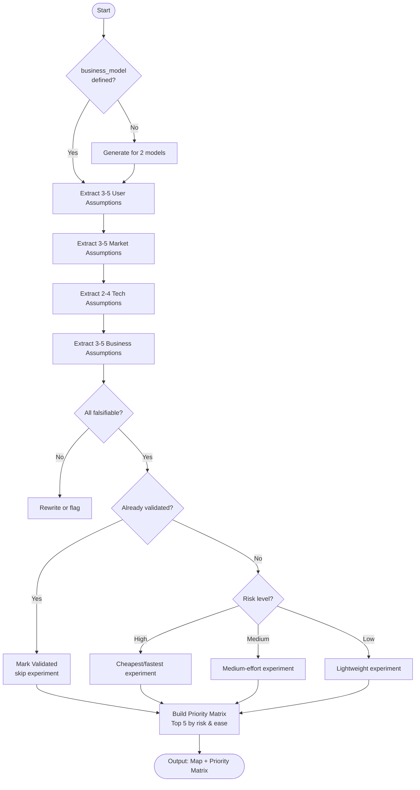

# Skill: Assumption Mapping

## Purpose
Surfaces and categorizes product assumptions by risk level and provides specific, low-cost validation experiments.

## Input
| Variable | Type | Required | Description |
|----------|------|----------|-------------|
| `{{product_idea}}` | string | yes | Brief product description |
| `{{business_model}}` | string | yes | Monetization strategy |
| `{{target_user}}` | string | yes | Primary user group |

## Prompt
- **User Assumptions**: 3–5 falsifiable assumptions about behavior/needs (Assumption, Risk, Experiment).
- **Market Assumptions**: 3–5 assumptions about size, competition, and timing.
- **Technical Assumptions**: 2–4 assumptions about feasibility and integrations.
- **Business Assumptions**: 3–5 assumptions about pricing and economics.
- **Priority Matrix**: Table of top 5 highest-risk assumptions (Priority, Category, Risk, Rationale, Method).

**Rules**:
- Risk Levels: High (fails product), Medium (needs changes), Low (minor adjustments).
- Matrix sorting: (1) Risk level, (2) Ease of validation.

## Examples
- @examples/input.md
- @examples/output.md

## Edge Cases
| Case | Strategy |
|------|----------|
| Already Validated | Mark as "Validated" and focus experiments on remaining gaps. |
| Specialty Domain | Flag assumptions requiring expert consulting (e.g., legal). |
| Undecided Model | Generate assumptions for both subscription and freemium models. |

## Output Format
- Five labeled sections with markdown headers.
- Structured lists for category assumptions.
- Priority markdown table.
- 600–900 words.

## Senior Review Checklist
- [ ] Solution is the simplest that could work?
- [ ] Failure modes handled?
- [ ] Scales to 10x load/codebase?
- [ ] Security implications addressed?
- [ ] Output testable and observable?

## Changelog
| Version | Date | Description |
|---------|------|-------------|
| 1.1.0 | 2026-03-20 | Restructured: moved examples, added compatibility and license fields |
| 1.0.0 | 2026-03-20 | Initial release |

## Mermaid Diagram

