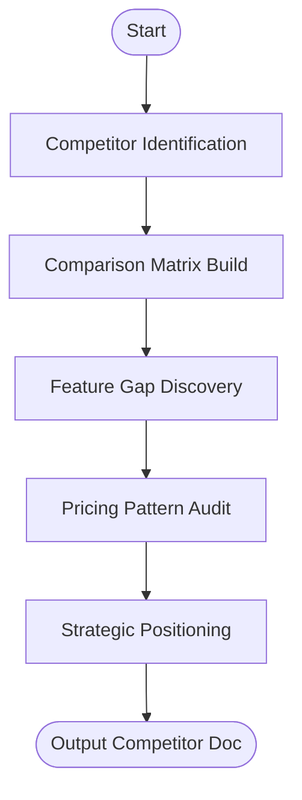

# Skill: Competitor Analysis

## Purpose
Produces structured competitive landscape analysis and strategic positioning.

## Input
| Variable | Type | Required | Description |
|----------|------|----------|-------------|
| `{{product_idea}}` | string | yes | Brief product description |
| `{{market_segment}}` | string | yes | Market segment (e.g., "B2B SaaS") |
| `{{known_competitors}}` | string | yes | Competitors list or "unknown" |

## Prompt
- **Comparison Table**: ≥4 competitors (Competitor, Type, Core Features, Pricing, Strengths, Weaknesses).
- **Feature Gap Analysis**: 3–5 underserved needs (Gap, Competitor Shortfall, Opportunity Size).
- **Pricing Landscape**: Patterns, ranges, and competitive point recommendation.
- **Positioning Angle**: Segment to avoid, gap to target, and 1-sentence statement.

## Rules
- If `{{known_competitors}}` is "unknown", generate based on segment.
- State uncertainty explicitly for data points.
- No filler text.

## Edge Cases
| Case | Strategy |
|------|----------|
| Niche Market | Include indirect/manual workarounds to reach 4 minimum. |
| Outdated Data | Flag Pricing/Features for manual verification. |

## Output Format
- Four sections (`##`).
- Table for Section 1; bulleted lists for Sections 2–4.

## Senior Review Checklist
- [ ] Gaps are genuinely underserved?
- [ ] Direct/Indirect competitors are balanced?
- [ ] Positioning statement is unique?
- [ ] Pricing recommendation is grounded?

## Changelog
| Version | Date | Description |
|---------|------|-------------|
| 1.1.0 | 2026-03-20 | Condensed format. |
| 1.0.0 | 2026-03-20 | Initial release. |

## Mermaid Diagram

