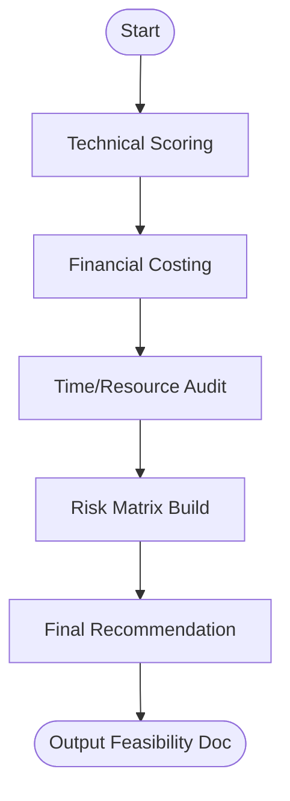

# Skill: Feasibility Assessment

## Purpose
Evaluates product ideas across technical, financial, and time dimensions.

## Input
| Variable | Type | Required | Description |
|----------|------|----------|-------------|
| `{{product_idea}}` | string | yes | Brief product description |
| `{{tech_stack}}` | string | yes | Target technology stack |
| `{{budget}}` | string | yes | Available budget |
| `{{timeline}}` | string | yes | Target timeline |
| `{{team_size}}` | string | yes | Available team resources |

## Prompt
- **Technical Score (1–10)**: Score and rationale (capabilities, APIs, scaling risks).
- **Financial Breakdown**: Table (Dev cost, Launch Infra, 1k User Infra) + Verdict.
- **Time Assessment**: Feature vs. Resource comparison + Verdict (On Track/Risk).
- **Risk Matrix**: Table (Risk, Dimension, Likelihood, Impact, Mitigation).
- **Final Recommendation**: Bold verdict (Go / Conditional / No-Go) with rationale.

## Rules
- Be direct about blockers.
- If tech stack undecided, recommend and assess one.
- No filler text.

## Edge Cases
| Case | Strategy |
|------|----------|
| Zero Budget | Identify required paid dependencies. |
| Impossible Timeline | Recommend scope reduction. |

## Output Format
- Five sections (`##`).
- Tables for risks and financials.

## Senior Review Checklist
- [ ] Technical score is justified by specific risks?
- [ ] Financials include recurring infrastructure costs?
- [ ] Timeline vs Team size logic is sound?
- [ ] Mitigations are actionable?

## Changelog
| Version | Date | Description |
|---------|------|-------------|
| 1.1.0 | 2026-03-20 | Condensed format. |
| 1.0.0 | 2026-03-20 | Initial release. |

## Mermaid Diagram

