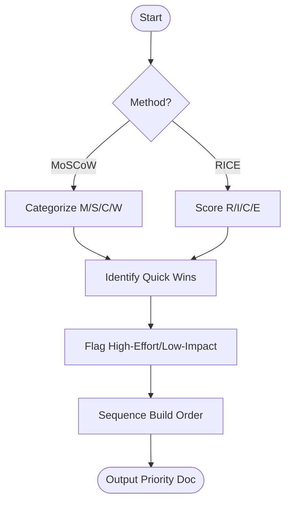

# Skill: Feature Prioritization

## Purpose
Scores and ranks feature lists using MoSCoW or RICE to determine build order.

## Input
| Variable | Type | Required | Description |
|----------|------|----------|-------------|
| `{{feature_list}}` | string | yes | Features (e.g., "dashboard, CSV export") |
| `{{scoring_method}}` | string | yes | "MoSCoW" or "RICE" |
| `{{target_users_count}}` | string | yes | Users count for RICE Reach |

## Prompt
- **Prioritization Table**: 
    - **If MoSCoW**: Table (Feature, Category, Rationale).
    - **If RICE**: Table (Feature, Reach, Impact, Confidence, Effort, RICE Score) sorted descending.
- **Top 3 Quick Wins**: Highest-value/lowest-effort items + 1-sentence rationale.
- **Low-Value Flags**: High-effort/low-impact items recommended for deferral/cut.
- **Build Order Summary**: 2–3 sentence execution strategy.

## Rules
- If <4 features, request more.
- Default to MoSCoW if method is invalid.
- No filler text.

## Edge Cases
| Case | Strategy |
|------|----------|
| Dependencies | Sequence dependent features correctly in rationale. |
| Score Ties | Use "unblocks other features" as a tiebreaker. |

## Output Format
- Four sections (`##`).
- Markdown table for scoring.

## Senior Review Checklist
- [ ] Scoring logic is consistent?
- [ ] Quick wins are genuinely low-effort?
- [ ] Build order respects technical dependencies?
- [ ] High-effort low-impact items are correctly flagged?

## Changelog
| Version | Date | Description |
|---------|------|-------------|
| 1.1.0 | 2026-03-20 | Condensed format. |
| 1.0.0 | 2026-03-20 | Initial release. |

## Mermaid Diagram

