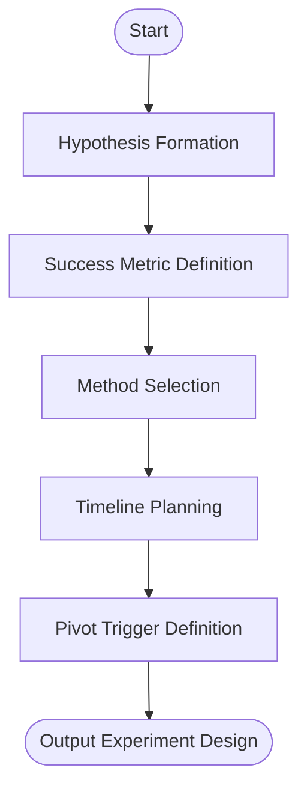

# Skill: Hypothesis Validation

## Purpose
Structures lean validation experiments for single assumptions with metrics and pivot triggers.

## Input
| Variable | Type | Required | Description |
|----------|------|----------|-------------|
| `{{assumption}}` | string | yes | Falsifiable assumption |
| `{{target_user}}` | string | yes | Target user group |
| `{{available_resources}}` | string | yes | Time, budget, and access |

## Prompt
- **Hypothesis**: "If [action], then [outcome], because [assumption]" (falsifiable).
- **Success Metrics**: Table (Metric, Target, Threshold, Method).
- **Experiment Method**: Step-by-step instructions for simplest method (interviews, smoke test).
- **Timeline**: Phased breakdown (Preparation, Execution, Analysis).
- **Pivot Triggers**: Explicit "Persevere if", "Pivot if", and "Investigate if" conditions.

## Rules
- Instructions must fit `{{available_resources}}`.
- No filler text.

## Edge Cases
| Case | Strategy |
|------|----------|
| Broad assumption | Break into sub-assumptions; test the most critical. |
| Low resources | Recommend minimum viable smoke test. |

## Output Format
- Six sections (`##`).
- Hypothesis quote block.
- Metrics table.

## Senior Review Checklist
- [ ] Hypothesis is falsifiable?
- [ ] Metric thresholds are objective?
- [ ] Pivot triggers are clear and actionable?
- [ ] Experiment fits provided resources?

## Changelog
| Version | Date | Description |
|---------|------|-------------|
| 1.1.0 | 2026-03-20 | Condensed format. |
| 1.0.0 | 2026-03-20 | Initial release. |

## Mermaid Diagram

