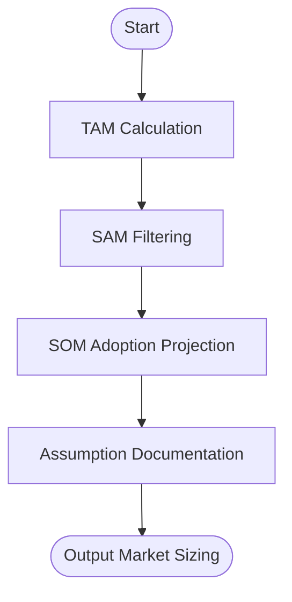

# Skill: Market Sizing

## Purpose
Estimates TAM, SAM, and SOM using top-down and bottom-up approaches.

## Input
| Variable | Type | Required | Description |
|----------|------|----------|-------------|
| `{{product_idea}}` | string | yes | Brief product description |
| `{{target_geography}}` | string | yes | Target geographic market |
| `{{target_segment}}` | string | yes | Target user segment |
| `{{pricing_model}}` | string | yes | Pricing model and point |

## Prompt
- **TAM (Top-Down)**: Potential population and annual revenue potential with sources.
- **SAM (Bottom-Up)**: Refined population (geography, segment, willingness-to-pay).
- **SOM (3-Year Capture)**: Realistic 3-year adoption table (Year, Share %, Customers, ARR).
- **Assumptions Table**: Assumption, Confidence (H/M/L), Verification Source.

## Rules
- Accompany all numbers with logic.
- Flag low-confidence estimates prominently.
- No filler text.

## Edge Cases
| Case | Strategy |
|------|----------|
| Global market | Recommend single launch region for reliable SAM. |
| Niche market | Use proxy markets; recommend primary research. |
| Undefined pricing | Model two scenarios to show impact. |

## Output Format
- Four sections (`##`).
- Tables for SOM capture and assumptions.

## Senior Review Checklist
- [ ] Logic for numbers is transparent?
- [ ] SOM reflects realistic adoption rates?
- [ ] Confidence levels are honest?
- [ ] Sources/Proxies are relevant?

## Changelog
| Version | Date | Description |
|---------|------|-------------|
| 1.1.0 | 2026-03-20 | Condensed format. |
| 1.0.0 | 2026-03-20 | Initial release. |

## Mermaid Diagram

