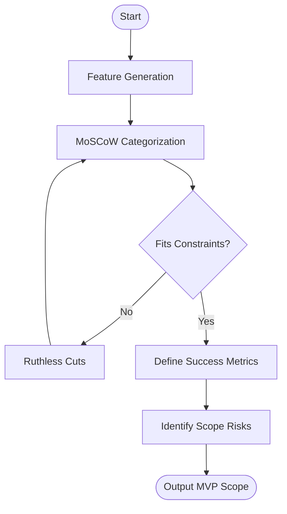

# Skill: MVP Scope Definition

## Purpose
Produces structured MVP scopes using MoSCoW to prevent scope creep.

## Input
| Variable | Type | Required | Description |
|----------|------|----------|-------------|
| `{{product_idea}}` | string | yes | Brief product description |
| `{{target_user}}` | string | yes | Primary target user |
| `{{time_constraint}}` | string | yes | Available launch time |
| `{{team_size}}` | string | yes | Available team resources |

## Prompt
- **MoSCoW Table**: Feature, Category (Must/Should/Could/Won't), Rationale, Effort (S/M/L/XL).
- **Definition Statement**: 3–5 sentences defining MVP boundaries.
- **Success Metrics**: 3–5 specific metrics (Name, Target, Method).
- **Risk Flags**: 2–3 scope risks and mitigations.

## Rules
- Be ruthless about scope.
- If "Must Have" exceeds constraints, flag and suggest cuts.
- No filler text.

## Edge Cases
| Case | Strategy |
|------|----------|
| Unrealistic scope | Flag overrun; recommend extreme simplification. |
| Solo + Complex | Recommend "concierge MVP" (manual processes). |

## Output Format
- Four sections (`##`).
- Markdown table for MoSCoW.
- Bulleted lists for metrics and risks.

## Senior Review Checklist
- [ ] Must-haves fit within launch timeline?
- [ ] MVP definition is clear and bounded?
- [ ] Effort estimates reflect team size?
- [ ] Success metrics are verifiable?

## Changelog
| Version | Date | Description |
|---------|------|-------------|
| 1.1.0 | 2026-03-20 | Condensed format. |
| 1.0.0 | 2026-03-20 | Initial release. |

## Mermaid Diagram

