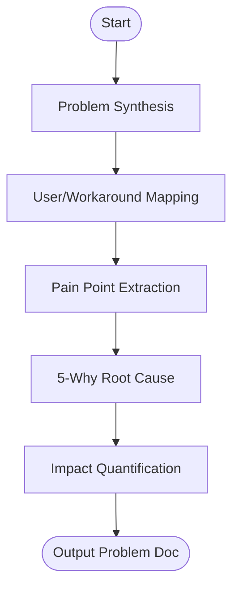

# Skill: Problem Identification

## Purpose
Structures the problem space to identify root causes before proposing solutions.

## Input
| Variable | Type | Required | Description |
|----------|------|----------|-------------|
| `{{product_idea}}` | string | yes | Brief product/feature description |
| `{{target_domain}}` | string | yes | Industry or problem context |

## Prompt
- **Problem Statement**: 3–5 sentences (situation, gap, consequence).
- **Affected Users**: Table (User Group, Role, Frequency, Current Workaround).
- **Pain Points**: ≥3 verifiable points (Action → Pain → Consequence).
- **Root Cause**: 5-Why analysis chain (min 3 levels).
- **Impact**: Quantified short-term (6mo) and long-term (2-3yr) consequences.

## Rules
- Do NOT suggest solutions.
- No filler text.

## Edge Cases
| Case | Strategy |
|------|----------|
| Solution-First | Extract the underlying problem from the solution. |
| Vague Idea | Ask developer to narrow to specific user action. |

## Output Format
- Five numbered sections.
- User table; bulleted pain points.

## Senior Review Checklist
- [ ] No solutions suggested?
- [ ] Root cause reaches systemic level?
- [ ] Pain points are verifiable behaviors?
- [ ] Consequences are quantified?

## Changelog
| Version | Date | Description |
|---------|------|-------------|
| 1.1.0 | 2026-03-20 | Condensed format. |
| 1.0.0 | 2026-03-20 | Initial release. |

## Mermaid Diagram

