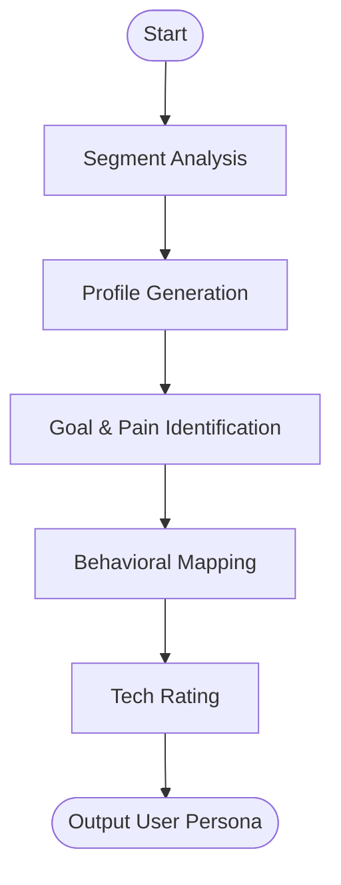

# Skill: Target User Definition

## Purpose
Generates actionable user personas to guide design and prioritization.

## Input
| Variable | Type | Required | Description |
|----------|------|----------|-------------|
| `{{product_idea}}` | string | yes | Brief product description |
| `{{user_segment}}` | string | yes | Specific target user group |

## Prompt
- **Persona Table**: Name, Role, and demographic summary.
- **Goals**: ≥3 concrete actionable work/life and product-specific goals.
- **Frustrations**: ≥3 specific frustrations and their consequences.
- **Behavioral Patterns**: Regular tools, discovery methods, and adoption context.
- **Tech Savviness**: Rating (Novice–Expert) with UX implications.
- **Quote**: One first-person sentence capturing core intent.

## Rules
- Ground traits in real-world behaviors.
- Generate exactly one persona.
- No filler text.

## Edge Cases
| Case | Strategy |
|------|----------|
| Broad segment | Ask developer to narrow scope first. |
| Niche segment | State assumptions; recommend real-user validation. |

## Output Format
- Five sections (`##`).
- Table for profile; bullet lists for goals/pains.

## Senior Review Checklist
- [ ] Persona is specific and non-generic?
- [ ] Goals align with product value?
- [ ] Tech savviness matches UX assumptions?
- [ ] Frustrations justify the product's existence?

## Changelog
| Version | Date | Description |
|---------|------|-------------|
| 1.1.0 | 2026-03-20 | Condensed format. |
| 1.0.0 | 2026-03-20 | Initial release. |

## Mermaid Diagram

