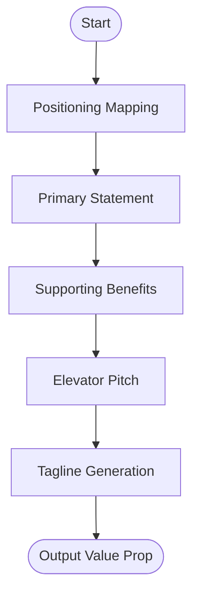

# Skill: Value Proposition Writing

## Purpose
Produces a structured value proposition defining target users, needs, benefits, and differentiators.

## Input
| Variable | Type | Required | Description |
|----------|------|----------|-------------|
| `{{product_idea}}` | string | yes | Brief product description |
| `{{target_user}}` | string | yes | Specific target user |
| `{{main_benefit}}` | string | yes | Primary product benefit |
| `{{competitor}}` | string | yes | Primary alternative/competitor |

## Prompt
- **Primary Value Prop**: Template-based positioning statement (For/Who/Is/That/Unlike).
- **Supporting Props**: List three distinct benefits (User Action → Improvement via Mechanism).
- **Elevator Pitch**: Two sentences (Problem/User + Function/Superiority).
- **Tagline Options**: Three options (Outcome, Problem, Differentiator focused).

## Rules
- Use concrete language; no marketing buzzwords.
- If no competitor, reframe as the "status quo".
- No filler text.

## Edge Cases
| Case | Strategy |
|------|----------|
| Vague benefit | Ask developer to quantify benefit details. |
| User Mismatch | Flag disconnect between user and benefit. |

## Output Format
- Four sections (`##`).
- Single quote block for Section 1.
- Bullet points for benefits and taglines.

## Senior Review Checklist
- [ ] Positioning clearly differentiates?
- [ ] Language is high-signal/low-fluff?
- [ ] Elevator pitch is concise (< 30s read)?
- [ ] Benefits are user-centric, not feature-centric?

## Changelog
| Version | Date | Description |
|---------|------|-------------|
| 1.1.0 | 2026-03-20 | Condensed format. |
| 1.0.0 | 2026-03-20 | Initial release. |

## Mermaid Diagram

