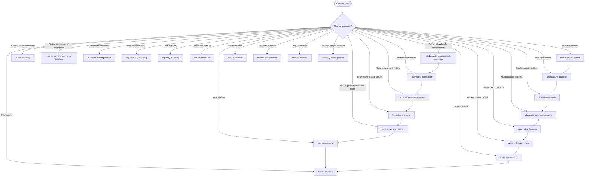

# Skills: Planning (23 skills)

This category contains skills for technical planning, architecture, and project management.

## Subdirectory Structure

Each skill in the `planning` category has the following structure:

```
{skill-name}/
├── SKILL.md          # Core instructions (≤500 lines)
├── references/       # Supporting technical documentation
│   ├── README.md
│   └── compatibility-matrix.md
├── assets/           # Planning document templates
│   └── template.md
└── examples/         # Concrete input/output examples
    ├── input.md
    └── output.md
```

## Skills

| Skill | Description |
|-------|-------------|
| `acceptance-criteria-writing` | Write acceptance criteria |
| `api-contract-design` | Design API contracts |
| `architecture-planning` | Plan system architecture |
| `brainstorm-feature` | Research-first technical design without code |
| `capacity-planning` | Plan infrastructure capacity |
| `cost-estimation` | Estimate development costs |
| `database-schema-planning` | Plan database schemas |
| `dependency-mapping` | Map dependencies between components |
| `domain-modeling` | Domain modeling (DDD) |
| `event-storming` | Event storming workshops |
| `feature-decomposition` | Decompose features into tasks |
| `memory-management` | Maintain memory.md for project architectural state |
| `microservices-boundary-definition` | Define microservice boundaries |
| `monolith-decomposition` | Decompose a monolith into microservices |
| `prepare-release` | Package a release: changelog, version bump, git tag |
| `risk-assessment` | Assess technical risks |
| `roadmap-creation` | Create product/technical roadmaps |
| `sla-slo-definition` | Define SLAs and SLOs |
| `sprint-planning` | Plan sprints |
| `stakeholder-requirement-extraction` | Extract stakeholder requirements |
| `system-design-review` | Review system designs |
| `tech-stack-selection` | Select a tech stack |
| `user-story-generation` | Generate user stories |

---

## Mermaid Diagram


