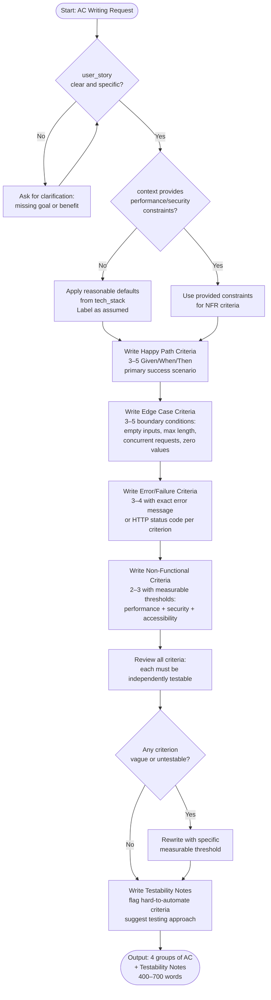

# Skill: Acceptance Criteria Writing

## Purpose
Produces testable acceptance criteria using Given/When/Then (EARS) format covering happy paths, edge cases, failures, and non-functional requirements.

## Input
| Variable | Type | Req | Description |
|----------|------|-----|-------------|
| `user_story` | string | Yes | Target user story |
| `tech_stack` | string | Yes | Technology stack |
| `context` | string | Yes | Constraints/Background |

## Instructions
- **Happy Path**: Write 3–5 criteria for primary success scenarios. Ensure they are specific and atomic.
- **Edge Cases**: Write 3–5 criteria for boundaries (empty inputs, max lengths, concurrent requests).
- **Errors**: Write 3–4 criteria for validation/auth/system failures with exact error codes/messages.
- **Non-Functional**: Write 2–3 criteria for measurable performance, security, and accessibility thresholds.
- **Testability**: Include notes flagging hard-to-automate criteria and suggest testing approaches.
- **Clarification**: If the goal or benefit is missing from the story, ask for details before proceeding.

## Edge Cases
| Case | Strategy |
|------|----------|
| Vague Story | Stop and request measurable targets/outcomes from the user. |
| Broad Story | Note the need for splitting; write for the most specific interpretation. |
| Missing NFRs | Apply stack-appropriate defaults (e.g., <200ms latency) and label as assumed. |

## Workflow

## Examples
- [Input Example](@examples/input.md)
- [Output Example](@examples/output.md)

## Quality Gate
- [ ] Criteria use Given/When/Then format.
- [ ] All 4 categories (Happy/Edge/Error/NFR) covered.
- [ ] Thresholds are measurable.
- [ ] Error messages are explicit.
- [ ] Testability notes included.

## Changelog
| Version | Date | Description |
|---------|------|-------------|
| 1.2.0 | 2026-03-21 | EARS → Given/When/Then. Exact errors required. |
| 1.1.0 | 2026-03-20 | Restructured: moved examples/references, added compatibility/license |
| 1.0.0 | 2026-03-20 | Initial release |
