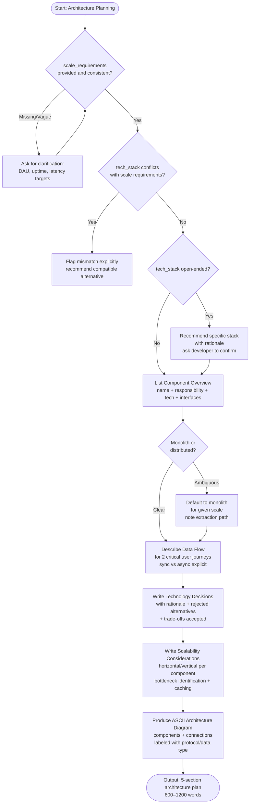

# Skill: Architecture Planning

## Purpose
Generate a comprehensive system architecture plan including component mapping, data flow, tech rationale, and scaling strategies.

## Input
| Variable | Type | Req | Description |
|----------|------|-----|-------------|
| `project_description`| string | Yes | High-level system overview |
| `tech_stack` | string | Yes | Core technologies |
| `scale_requirements` | string | Yes | Load, DAU, SLA targets |

## Instructions
- **Components**: Define names, responsibilities, and exposed/consumed interfaces for every system block.
- **Data Flow**: Map at least 2 critical user journeys with numbered steps; distinguish sync vs async paths.
- **Rationale**: Document tech choices including rejected alternatives and accepted trade-offs.
- **Scalability**: Address horizontal/vertical scaling, stateful vs stateless components, and caching strategies.
- **Diagram**: Provide an ASCII box-and-arrow diagram with protocol/data labels.
- **Pathing**: Default to monolith if system scale or boundaries are ambiguous; describe the extraction path.

## Edge Cases
| Case | Strategy |
|------|----------|
| Scale Conflict | Flag tech/scale mismatches; recommend compatible alternatives. |
| Open Stack | Recommend a specific, opinionated stack with rationale; ask for confirmation. |
| Microservices | If requested but DAU is low, propose a modular monolith first. |

## Workflow

## Examples
- [Input Example](@examples/input.md)
- [Output Example](@examples/output.md)

## Quality Gate
- [ ] Components have clear boundaries.
- [ ] Data flows cover critical paths.
- [ ] Tech choices are justified.
- [ ] Scalability strategy is quantified.
- [ ] Diagram included.

## Changelog
| Version | Date | Description |
|---------|------|-------------|
| 1.1.0 | 2026-03-20 | Restructured: moved examples/references, added compatibility/license |
| 1.0.0 | 2026-03-20 | Initial release |
