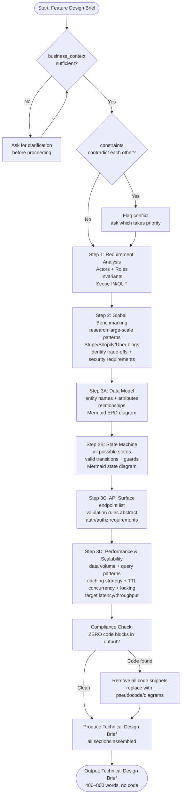

# Skill: Brainstorm Feature

## Purpose
Produces a production-ready technical design brief covering logic, state, data, and performance targets. **ZERO CODE ALLOWED**.

## Input
| Variable | Type | Req | Description |
|----------|------|-----|-------------|
| `feature_name` | string | Yes | Feature name |
| `business_context` | string | Yes | Problem and value |
| `tech_stack` | string | Yes | Target stack |
| `constraints` | string | No | Latency, offline, etc. |

## Instructions
- **Analysis**: Define Actors, Roles, Scope (In/Out), and Invariants (e.g., `balance >= 0`).
- **Benchmarking**: Research industry patterns (Stripe/Shopify) to identify bottlenecks and security requirements.
- **Data Model**: List entities, attributes, and relationships; include a Mermaid ERD.
- **State Machine**: Map all possible states and valid transitions; include a Mermaid state diagram.
- **API Surface**: Define endpoints (path, method) with abstract validation rules and AuthZ requirements.
- **Performance**: Specify data volume patterns, caching (TTL), locking, and latency/throughput targets.
- **Strict Rule**: Remove ALL code snippets; replace with pseudocode, diagrams, or requirements.

## Edge Cases
| Case | Strategy |
|------|----------|
| Sparse Context | Stop and request business value/user goal details first. |
| Contradictory | Flag conflicting constraints and ask for priority before designing. |
| Existing Code | Acknowledge current implementation and design compatible extensions. |

## Workflow

## Examples
- [Input Example](@examples/input.md)
- [Output Example](@examples/output.md)

## Quality Gate
- [ ] Business problem addressed.
- [ ] Data model is backward-compatible.
- [ ] Integration points identified.
- [ ] NO code blocks included.
- [ ] State machine is complete.

## Changelog
| Version | Date | Description |
|---------|------|-------------|
| 1.1.0 | 2026-03-20 | Restructured: moved examples/references, added compatibility/license |
| 1.0.0 | 2026-03-20 | Initial release |
