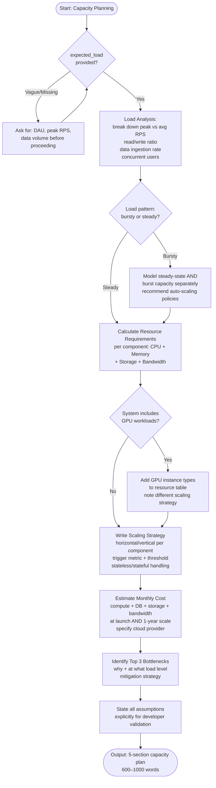

# Skill: Capacity Planning

## Purpose
Estimate infrastructure requirements (Compute, DB, Storage, Bandwidth) based on load projections and growth rates.

## Input
| Variable | Type | Req | Description |
|----------|------|-----|-------------|
| `system_description` | string | Yes | Components |
| `expected_load` | string | Yes | DAU, RPS, Growth |
| `tech_stack` | string | Yes | Platform/Stack |

## Instructions
- **Load Analysis**: Break down Peak/Avg RPS, Read/Write ratio, and seasonal spike patterns.
- **Resources**: Map components to CPU, Memory, Storage (Launch vs 1-year), and Bandwidth in a table.
- **Scaling**: Define Horizontal/Vertical triggers, thresholds, and stateful vs stateless handling.
- **Costing**: Estimate monthly costs per category (Compute/DB/Storage) for launch and 1-year scale.
- **Bottlenecks**: Identify top 3 bottlenecks manifest levels and provide mitigation strategies.
- **Clarification**: Request specific DAU/RPS if provided load info is vague or missing.

## Edge Cases
| Case | Strategy |
|------|----------|
| No projections | Stop; request DAU and peak throughput estimates first. |
| Bursty load | Model steady-state and burst capacity (auto-scaling) separately. |
| GPU | Include specific GPU instance types and non-standard scaling logic. |

## Workflow

## Examples
- [Input Example](@examples/input.md)
- [Output Example](@examples/output.md)

## Quality Gate
- [ ] RPS calculations include peak scenarios.
- [ ] Resource table covers all components.
- [ ] Scaling triggers are quantified.
- [ ] Cost estimates specify cloud provider.
- [ ] Assumptions are listed.

## Changelog
| Version | Date | Description |
|---------|------|-------------|
| 1.1.0 | 2026-03-20 | Restructured: moved examples/references, added compatibility/license |
| 1.0.0 | 2026-03-20 | Initial release |
