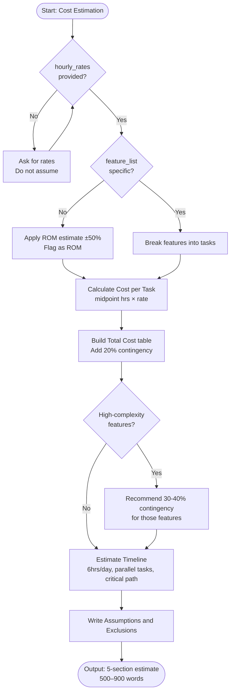

# Skill: Cost Estimation

## Purpose
Produce a defensible development cost estimate covering tasks, roles, contingency, and estimated timeline.

## Input
| Variable | Type | Req | Description |
|----------|------|-----|-------------|
| `feature_list` | string | Yes | Targets for estimation |
| `tech_stack` | string | Yes | Technology stack |
| `team_composition` | string | Yes | Roles involved |
| `hourly_rates` | string | Yes | Rate per role |

## Instructions
- **Task Breakdown**: List tasks per feature with Role, Low/High/Mid hours, and Complexity.
- **Cost Calculation**: Multiply midpoint hours by provided role rates in a markdown table.
- **Grand Total**: Sum sub-totals; add a 20% contingency (30-40% for high-risk items) and provide final estimate.
- **Timeline**: Estimate calendar duration based on 6 productive hours/day/person; identify critical paths.
- **Rules**: If rates or team info are missing, ask for them; do not invent market rates.
- **Validation**: State all assumptions (e.g., "API spec is final") and explicit exclusions (e.g., "hosting").

## Edge Cases
| Case | Strategy |
|------|----------|
| No Rates | Stop; request explicit rates before performing any calculations. |
| Vague List | Provide a "Rough Order of Magnitude" (ROM) estimate (±50%) and flag it. |
| High-Risk | Recommend and justify a 40% contingency for items like "Real-time sync". |

## Workflow

## Examples
- [Input Example](@examples/input.md)
- [Output Example](@examples/output.md)

## Quality Gate
- [ ] Hourly rates applied as provided.
- [ ] Contingency buffer included and justified.
- [ ] Timeline accounts for parallel work.
- [ ] Assumptions and Exclusions explicit.
- [ ] Tasks mapped to specific roles.

## Changelog
| Version | Date | Description |
|---------|------|-------------|
| 1.1.0 | 2026-03-20 | Restructured: moved examples/references, added compatibility/license |
| 1.0.0 | 2026-03-20 | Initial release |
