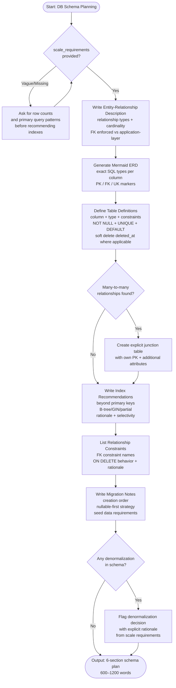

# Skill: Database Schema Planning

## Purpose
Generate a normalized relational schema plan including ERD, table definitions, and migration strategies.

## Input
| Variable | Type | Req | Description |
|----------|------|-----|-------------|
| `domain_description` | string | Yes | Entities and domain |
| `tech_stack` | string | Yes | DB and ORM details |
| `scale_requirements` | string | Yes | Volume and query patterns |

## Instructions
- **ERD Description**: Define relationships (1:1, 1:N, M:N), cardinality, and FK enforcement.
- **Mermaid Diagram**: Provide a visual ERD with exact column types (e.g., `varchar(255)`) and constraints.
- **Table Specs**: For every table, list columns with types, NOT NULL, UNIQUE, and soft delete (`deleted_at`).
- **Indexes**: Recommend non-PK indexes with rationale and estimated selectivity.
- **Constraints**: List all Foreign Keys with `ON DELETE` behavior.
- **Normalization**: Target 3NF; flag and justify any denormalization based on scale needs.
- **Migrations**: Define creation order, nullable-first strategies, and seed requirements.

## Edge Cases
| Case | Strategy |
|------|----------|
| Many-to-Many | Always create an explicit junction table with its own PK and timestamps. |
| Soft Delete | Include `deleted_at TIMESTAMPTZ` and recommend partial indexes for active data. |
| Vague Scale | Stop; request row count estimates and query patterns before indexing. |

## Workflow

## Examples
- [Input Example](@examples/input.md)
- [Output Example](@examples/output.md)

## Quality Gate
- [ ] 3NF normalization achieved (or denormalization justified).
- [ ] Mermaid ERD uses exact SQL types.
- [ ] Junction tables used for M:N.
- [ ] Soft delete included.
- [ ] Creation order is logical.

## Changelog
| Version | Date | Description |
|---------|------|-------------|
| 1.2.0 | 2026-03-21 | Mandatory Mermaid ERD. 5 → 6 sections. |
| 1.1.0 | 2026-03-20 | Restructured: moved examples/references, added compatibility/license |
| 1.0.0 | 2026-03-20 | Initial release |
