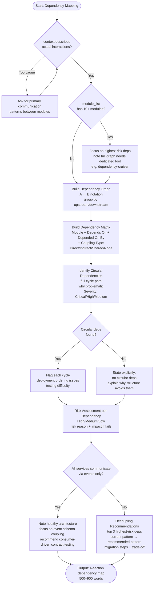

# Skill: Dependency Mapping

## Purpose
Identify module/service dependencies, flag circular or risky patterns, and recommend decoupling strategies.

## Input
| Variable | Type | Req | Description |
|----------|------|-----|-------------|
| `module_list` | string | Yes | Modules to map |
| `tech_stack` | string | Yes | Technology stack |
| `context` | string | Yes | Interaction details |

## Instructions
- **Graph**: Provide a text-based `A -> B` map grouped by upstream/downstream layers.
- **Matrix**: Use a markdown table: Module | Depends On | Depended On By | Coupling Type (Direct/Shared/None).
- **Circular Check**: List all cycles, their severity (Critical/High), and the problems caused (e.g., deployment locks).
- **Risk Assessment**: Identify high-risk dependencies based on coupling strength and failure impact.
- **Remediation**: Provide decoupling plans (Event-driven, API gateway, Dependency Injection) for top risks.
- **Vague context**: If interactions are unclear, stop and ask for communication patterns.

## Edge Cases
| Case | Strategy |
|------|----------|
| Large List | Focus exclusively on highest-risk dependencies; recommend `dependency-cruiser` for full maps. |
| Event-driven | Risk focuses on schema coupling; recommend consumer-driven contract testing. |
| No Context | Ask for primary interaction types (REST vs PubSub) before mapping. |

## Workflow

## Examples
- [Input Example](@examples/input.md)
- [Output Example](@examples/output.md)

## Quality Gate
- [ ] Dependency graph uses `A -> B` notation.
- [ ] Circular dependencies identified (or absence justified).
- [ ] Risk levels severity-rated.
- [ ] Decoupling strategies provide migration steps.
- [ ] Coupling types defined.

## Changelog
| Version | Date | Description |
|---------|------|-------------|
| 1.1.0 | 2026-03-20 | Restructured: moved examples/references, added compatibility/license |
| 1.0.0 | 2026-03-20 | Initial release |
