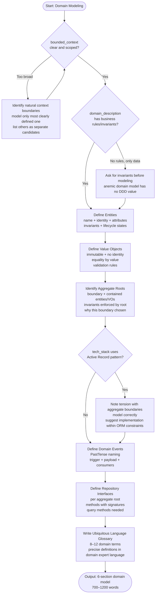

# Skill: Domain Modeling

## Purpose
Produces a Domain-Driven Design (DDD) model for a bounded context. Identifies entities, value objects, aggregates, domain events, repository interfaces, and a ubiquitous language glossary.

## Input
| Variable | Type | Required | Description |
|----------|------|----------|-------------|
| `{{domain_description}}` | string | yes | Business domain and rules |
| `{{tech_stack}}` | string | yes | Target tech stack |
| `{{bounded_context}}` | string | yes | Specific bounded context to model |

## Prompt
> **Anti-Hallucination:** Follow `.agents/rules/anti-hallucination.md`. Show chain-of-thought. State assumptions. Say "I don't know" if uncertain. Use provided context only.

Act as a senior DDD architect.

Domain: {{domain_description}}
Stack: {{tech_stack}}
Context: {{bounded_context}}

Produce 6 sections:

**1. Entity Definitions**
For each entity: Name (PascalCase), Identity, Key attributes, Invariants, Lifecycle states.

**2. Value Objects**
For each value object: Name (PascalCase), Attributes, Why it is a VO, Validation rules.

**3. Aggregate Roots**
For each aggregate: Root name, Contained entities/VOs, Enforced invariants, Why boundary chosen.

**4. Domain Events**
For each event: Name (PastTense), Trigger, Payload, Consumers.

**5. Repository Interfaces**
For each aggregate root: Interface name, Method signatures (pseudocode/target language), Query methods.

**6. Ubiquitous Language Glossary**
8–12 domain terms defined in business language, avoiding technical jargon.

Ask for clarification if context is unclear/overlapping. Do not model outside the bounded context.

## Examples
@examples/input.md
@examples/output.md

## Edge Cases
1. **Context too broad**: Identify natural boundaries, model the clearest one, list others as candidates.
2. **Anemic model**: Ask for business rules/invariants before modeling.
3. **Tech stack conflict (Active Record)**: Note tension, model domain correctly, suggest ORM-compatible implementation.

## Output Format
Six markdown sections. Sections 1-4 use lists. Section 5 uses code blocks. Section 6 uses definition list. 700–1200 words.

## Senior Review Checklist
1. Is this solution the simplest that could work?
2. What are the failure modes and how are they handled?
3. How does this scale to 10x load or 10x codebase size?
4. Are there security implications that need to be addressed?
5. Is the output testable and observable in production?

## Changelog
| Version | Date | Description |
|---------|------|-------------|
| 1.1.0 | 2026-03-20 | Restructured: examples/ and references/, added compatibility/license |
| 1.0.0 | 2026-03-20 | Initial release |

## MCP Dependencies
- `@modelcontextprotocol/server-sequential-thinking`
- `@modelcontextprotocol/server-memory`

## Output Path
`.agents/documents/design/domain/`

## Mermaid Diagram
