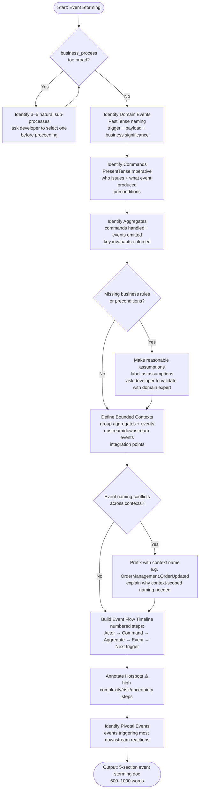

# Skill: Event Storming

## Purpose
Produces structured event storming documentation identifying domain events, commands, aggregates, bounded contexts, and timeline. Replicates workshop outputs for distributed teams.

## Input
| Variable | Type | Required | Description |
|----------|------|----------|-------------|
| `{{domain_description}}` | string | yes | Business domain (e.g., "Food delivery") |
| `{{business_process}}` | string | yes | Process to storm (e.g., "Customer orders food") |

## Prompt
Act as a senior DDD facilitator.

Domain: {{domain_description}}
Process: {{business_process}}

Produce 5 sections:

**1. Domain Events (Orange)**
Domain Events represent something that happened in the system. Names must be **past tense verbs** (e.g., `OrderPlaced`, `UserRegistered`, `PaymentFailed`).
List domain events. For each:
- Event name (PastTense)
- Trigger condition
- Payload fields
- Business significance

**2. Commands (Blue)**
Commands represent intentions to change state. Names must be **present tense imperative** (e.g., `PlaceOrder`, `RegisterUser`, `ProcessPayment`).
List commands triggering events. For each:
- Command name (PresentTenseImperative)
- Issuer
- Event produced
- Preconditions

**3. Aggregates (Yellow)**
Identify processing aggregates. For each:
- Name
- Handled commands
- Emitted events
- Key invariants

**4. Bounded Contexts**
Group aggregates and events. For each:
- Name
- Aggregates contained
- Upstream/downstream events
- Integration points

**5. Event Flow Timeline**
Create a numbered chronological timeline:
Step N: [Actor] issues [Command] → [Aggregate] processes → [Event] emitted → [Next step trigger]

Identify:
- Hotspots: Mark high complexity/risk steps with ⚠️.
- Pivotal events: Events triggering most downstream reactions.

If process is too broad, identify sub-processes and ask to select one.

## Examples
@examples/input.md
@examples/output.md

## Edge Cases
1. **Process too large**: Identify 3–5 sub-processes, ask developer to pick one.
2. **Missing business rules**: Make assumptions, label them, ask developer to validate.
3. **Naming conflicts**: Prefix with context name (e.g., "Order.OrderUpdated"), explain reasoning.

## Output Format
Five markdown sections. Sections 1–4 use structured lists. Section 5 uses numbered timeline with annotations. 600–1000 words.

## Senior Review Checklist
1. Is this solution the simplest that could work?
2. What are the failure modes and how are they handled?
3. How does this scale to 10x load or 10x codebase size?
4. Are there security implications that need to be addressed?
5. Is the output testable and observable in production?

## Changelog
| Version | Date | Description |
|---------|------|-------------|
| 1.1.0 | 2026-03-20 | Restructured: examples/ and references/, added compatibility/license |
| 1.0.0 | 2026-03-20 | Initial release |

## MCP Dependencies
- `@modelcontextprotocol/server-sequential-thinking`

## Output Path
`.agents/documents/design/domain/`

## Mermaid Diagram
