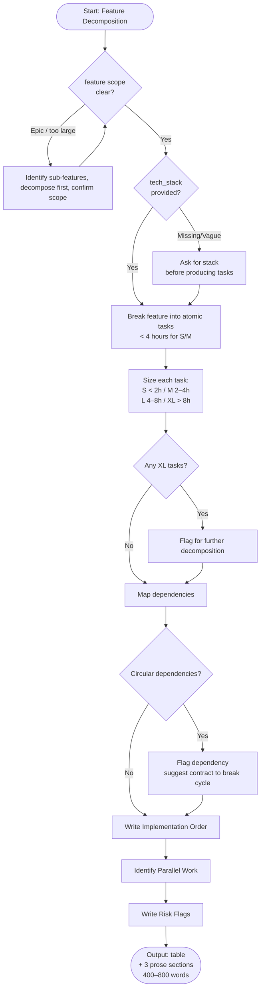

# Skill: Feature Decomposition

## Purpose
Transforms a high-level feature description into atomic, independently implementable tasks. Sizes tasks, maps dependencies, and defines acceptance criteria to eliminate ambiguity.

## Input
| Variable | Type | Required | Description |
|----------|------|----------|-------------|
| `{{feature_name}}` | string | yes | Feature name (e.g., "OAuth2 Authentication") |
| `{{tech_stack}}` | string | yes | Target tech stack (e.g., "Next.js + Prisma + PostgreSQL") |
| `{{context}}` | string | yes | Feature description, system context, or constraints |

## Prompt
You are a senior software architect planning a feature.

Feature: {{feature_name}}
Tech stack: {{tech_stack}}
Context: {{context}}

Break this feature into atomic, independently implementable tasks. Each task must take under 4 hours (S/M).

Produce a task breakdown table:

| Task # | Task Name | Description | Effort (S/M/L/XL) | Dependencies | Acceptance Criteria |
|--------|-----------|-------------|-------------------|--------------|---------------------|

Effort sizing guide:
- S (Small): < 2 hours — single function, config change, simple UI
- M (Medium): 2–4 hours — complete module, API endpoint, multi-step logic
- L (Large): 4–8 hours — subsystem, complex integration
- XL (Extra Large): > 8 hours — further decompose if possible

Provide:

**Implementation Order**: Sequence of tasks respecting dependencies.
**Parallel Work Opportunities**: Tasks that can run simultaneously.
**Risk Flags**: Tasks with high uncertainty, external dependencies, or blockers.

If input is missing or scope unclear, ask for clarification. Do not assume scope.

## Examples

@examples/input.md
@examples/output.md

## Edge Cases
1. **Feature too large**: If `{{feature_name}}` is an epic, identify sub-features, decompose the first, and ask for scope confirmation.
2. **Missing tech stack**: If `{{tech_stack}}` is missing/vague, ask for it before producing tasks.
3. **Circular dependencies**: Flag explicitly and suggest an interface/contract to break the cycle.

## Output Format
Markdown table (Task #, Task Name, Description, Effort, Dependencies, Acceptance Criteria), followed by Implementation Order, Parallel Work Opportunities, and Risk Flags. 400–800 words.

## Senior Review Checklist
1. Is this solution the simplest that could work?
2. What are the failure modes and how are they handled?
3. How does this scale to 10x load or 10x codebase size?
4. Are there security implications that need to be addressed?
5. Is the output testable and observable in production?

## Changelog
| Version | Date | Description |
|---------|------|-------------|
| 1.1.0 | 2026-03-20 | Restructured: moved examples, added compatibility and license fields |
| 1.0.0 | 2026-03-20 | Initial release |

## MCP Dependencies

- `@modelcontextprotocol/server-sequential-thinking` — Structured multi-step reasoning
- `@modelcontextprotocol/server-memory` — Persistent memory

## Output Path

```
.agents/documents/tasks/backlog/{feature-slug}.md
```

## Mermaid Diagram

