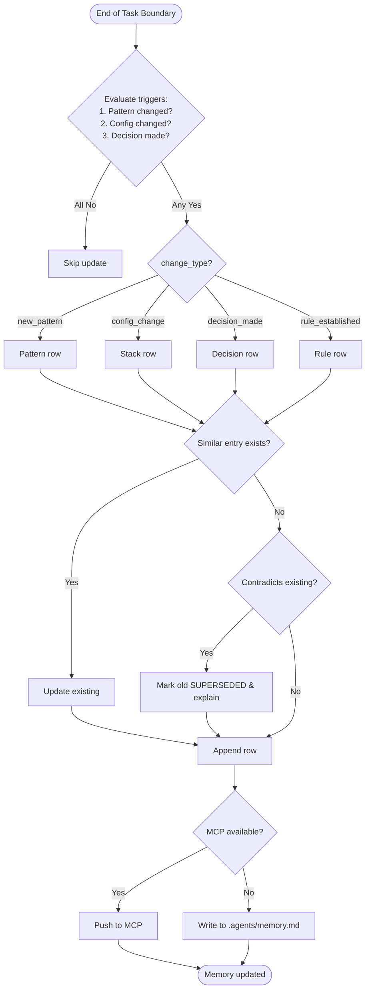

# Skill: Memory Management

## Purpose
Maintains a `memory.md` file as persistent architectural context across sessions. Records system state, patterns, and rules. Answers "What is this system?" and "How should things be done here?". Do not track status or progress.

## Input
| Variable | Type | Required | Description |
|----------|------|----------|-------------|
| `{{memory_file_path}}` | string | yes | Path to memory file (e.g., `.agents/memory.md`) |
| `{{change_type}}` | string | yes | `new_pattern`, `config_change`, `decision_made`, `rule_established` |
| `{{change_description}}` | string | yes | What changed and why |

## Prompt
Maintain the project's architectural memory file.

Memory file: {{memory_file_path}}
Change type: {{change_type}}
Change: {{change_description}}

### When to Update memory.md

Update ONLY for:
- New architectural patterns
- Global configuration changes
- Significant architectural decisions
- Project-wide rules

DO NOT update for:
- Task completion
- Bug fixes
- Sprint progress

### Memory File Format

Use strict key-value table format:

```markdown
# Project Memory

| Category | Key | Value |
|----------|-----|-------|
| Stack | Framework | Laravel 12 + Filament v5 |
| Stack | Database | PostgreSQL 16 |
| Pattern | Service Methods | All static, return Closure for actions |
| Pattern | Primary Keys | UUID (all tables) |
| Pattern | Testing | 4-concern: Database/Services/States/UI |
| Decision | Auth | JWT with refresh tokens, 15min expiry |
| Rule | Decimal Precision | 15,2 for monetary values |
```

### Rules

- **Table only**: No prose, sentences, or paragraphs
- **Minimal words**: Title Case or short phrases in Value column
- **No status tracking**: No "Done", "In Progress", "Pending"
- **No problem logs**: No "Fixed X", "Resolved Y"
- **Atomic entries**: One fact per row

### Maintenance Trigger

At the end of every significant task boundary, evaluate:
1. Did an architectural pattern change?
2. Did a global configuration change?
3. Was a project-wide decision made?

If YES to any → update memory.md.
If NO → skip.

## MCP Dependencies

- `@modelcontextprotocol/server-sequential-thinking` — Structured multi-step reasoning
- `@modelcontextprotocol/server-memory` — Persistent knowledge graph memory

## Output Path

```
.agents/documents/design/architecture/
```

## Edge Cases
- **Duplicate entry**: Update existing entry; do not duplicate.
- **Contradicting entry**: Mark old entry `[SUPERSEDED]` and explain.
- **MCP unavailable**: Write to `.agents/memory.md` and sync later.

## Output Format
Formatted memory entry for `.agents/memory.md` or MCP memory. Include: date, type, context, decision/pattern, impact, Do NOT field. 50–150 words per entry.

## Senior Review Checklist
- [ ] Is entry type correct?
- [ ] Is context specific enough for future use?
- [ ] Does 'Do NOT' field capture common mistakes?
- [ ] Is entry dated correctly?
- [ ] Is entry consistent with existing entries?

## Changelog
| Version | Date | Description |
|---------|------|-------------|
| 1.1.0 | 2026-03-20 | Restructured examples/references, added compatibility/license |
| 1.0.0 | 2026-03-20 | Initial release |

## Mermaid Diagram

