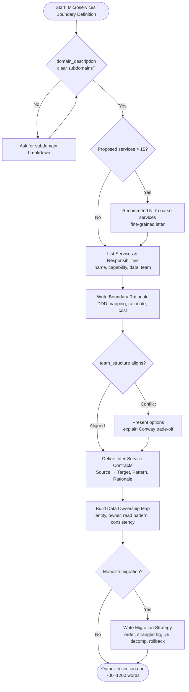

# Skill: Microservices Boundary Definition

## Purpose
Defines service boundaries for microservices using Domain-Driven Design principles. Produces service list, boundary rationale, contracts, data ownership map, and migration strategy. Prevents drawing boundaries around technical layers instead of business capabilities.

## Input
| Variable | Type | Required | Description |
|----------|------|----------|-------------|
| `{{domain_description}}` | string | yes | Business domain and subdomains |
| `{{tech_stack}}` | string | yes | Target technology stack |
| `{{team_structure}}` | string | yes | Team composition and structure |

## Prompt
> **Anti-Hallucination:** Follow `.agents/rules/anti-hallucination.md`. Show chain-of-thought reasoning. State assumptions. Say "I don't know" if uncertain. Use only provided context.

Act as a senior microservices architect defining service boundaries.

Domain description: {{domain_description}}

Technology stack: {{tech_stack}}

Team structure: {{team_structure}}

Produce a microservices boundary definition document with five sections:

**1. Service List with Responsibilities**
For each proposed microservice, list:
- Service name
- Core responsibility (one sentence business capability)
- Key operations exposed
- Owned data (entities/tables)
- Team ownership

**2. Boundary Rationale (DDD)**
For each boundary, explain:
- Mapped DDD bounded context
- Rationale (cohesion, ownership, change frequency, consistency)
- Cost of wrong boundary
- Conway's Law alignment (team structure match)

**3. Inter-Service Communication Contracts**
For each interaction, specify:
- Source → Target
- Pattern: sync (REST/gRPC) or async (event/message)
- Contract: endpoint or event schema
- Rationale

Use table format:
| Source | Target | Pattern | Contract | Rationale |
|--------|--------|---------|----------|-----------|

**4. Data Ownership Map**
For each entity/domain, specify:
- Entity name
- Owning service
- Read access services
- Read access method (API, event-sourced, shared replica)
- Consistency model (strong/eventual)

**5. Migration Strategy from Monolith**
If migrating, provide:
- Extraction order and rationale (risk/value)
- Strangler fig pattern application
- Shared database decomposition strategy
- Rollback strategy

Flag Conway's Law tensions if team structure misaligns with domain boundaries; recommend prioritization.

## Examples

@examples/input.md
@examples/output.md

## Edge Cases
1. **Team structure conflicts with domain boundaries**: Present both options, explain trade-offs, recommend priority based on maturity and change frequency.
2. **Too many proposed services (15+)**: Recommend 5–7 coarse-grained services initially; defer fine-grained decomposition until operational experience grows.
3. **Shared database across services**: Address decomposition challenge, recommend strangler fig + dual-write, warn against shared database anti-pattern.

## Output Format
Five labeled sections. Section 3: markdown table. Sections 1, 2, 4, 5: structured prose and bullet lists. 700–1200 words.

## Senior Review Checklist
1. Is this solution the simplest that could work?
2. What are the failure modes and how are they handled?
3. How does this scale to 10x load or 10x codebase size?
4. Are there security implications?
5. Is the output testable and observable?

## Changelog
| Version | Date | Description |
|---------|------|-------------|
| 1.1.0 | 2026-03-20 | Restructured examples/references, added compatibility/license |
| 1.0.0 | 2026-03-20 | Initial release |

## MCP Dependencies

- `@modelcontextprotocol/server-sequential-thinking` — Structured multi-step reasoning
- `@modelcontextprotocol/server-memory` — Persistent knowledge graph memory

## Output Path

```
.agents/documents/design/architecture/
```

## Mermaid Diagram

