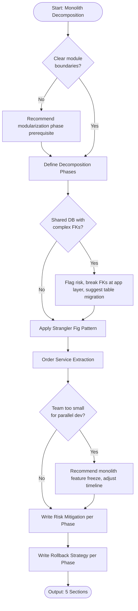

# Skill: Monolith Decomposition

## Purpose
Produce incremental decomposition plans for migrating monoliths to service-oriented architectures. Apply the strangler fig pattern to minimize risk, define extraction order based on coupling analysis, provide risk mitigation per phase, and include rollback strategies.

## Input
| Variable | Type | Required | Description |
|----------|------|----------|-------------|
| `{{monolith_description}}` | string | yes | Description of monolith (modules, size, tech, pain points) |
| `{{tech_stack}}` | string | yes | Current stack and target stack (e.g., "Rails → Node.js") |
| `{{target_architecture}}` | string | yes | Desired end state (e.g., "5 independent services") |

## Prompt
You are a senior software architect planning the incremental decomposition of a monolith.

Monolith description: {{monolith_description}}
Technology stack: {{tech_stack}}
Target architecture: {{target_architecture}}

Produce a monolith decomposition plan with 5 sections:

**1. Decomposition Phases**
Organize into 3–5 phases. For each:
- Phase name and goal
- Services to extract
- Duration estimate
- Team capacity required
- Success criteria

**2. Strangler Fig Pattern Application**
Describe strangler fig pattern application:
- Routing layer: API gateway, reverse proxy, feature flags
- Incremental cutover: %-based, flag-based, path-based
- Parallel running period: Before decommissioning monolith code
- Verification: Verify identical results before full cutover

**3. Service Extraction Order**
List services in extraction order. For each:
- Service name
- Extraction rationale: Low coupling, high value, team readiness
- Coupling score: Dependent modules (lower = easier)
- Estimated extraction effort: S/M/L/XL
- Database tables to migrate

**4. Risk Mitigation per Phase**
Identify for each phase:
- Top 2 risks
- Mitigation strategy
- Go/no-go criteria: Must be true before next phase

**5. Rollback Strategy**
Describe for each phase:
- Rollback trigger: Revert conditions
- Rollback procedure: Step-by-step
- Data consistency: Handling new service data during rollback window
- Time to rollback: Estimate

If monolith description is too vague to identify module boundaries, ask for module list or dependency map.

## Examples

@examples/input.md
@examples/output.md

## Edge Cases
1. **Highly coupled monolith (no clear boundaries)**: Recommend modularization phase (refactor into modules without changing deployment) as prerequisite to extraction.
2. **Shared DB with complex foreign keys**: Flag as highest risk, recommend breaking FKs at application layer first, suggest table-by-table migration sequence.
3. **Team too small for parallel development**: Recommend feature freeze on monolith during extraction, adjust timeline accordingly.

## Output Format
5 numbered sections. Section 3 uses numbered list with attributes per service. Sections 1, 2, 4, 5 use prose and bullet lists. Total: 700–1200 words.

## Senior Review Checklist
1. Simplest solution?
2. Failure modes handled?
3. Scales to 10x?
4. Security implications addressed?
5. Testable/observable in production?

## Changelog
| Version | Date | Description |
|---------|------|-------------|
| 1.1.0 | 2026-03-20 | Restructured: moved examples, references, added metadata |
| 1.0.0 | 2026-03-20 | Initial release |

## MCP Dependencies

- `@modelcontextprotocol/server-sequential-thinking` — Multi-step reasoning
- `@modelcontextprotocol/server-memory` — Knowledge graph memory

## Output Path
```
.agents/documents/design/architecture/
```

## Mermaid Diagram

