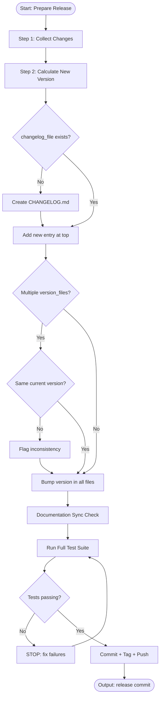

# Skill: Prepare Release

## Purpose
Packages completed work into releasable versions. Collects changes, generates structured changelogs, bumps Semantic Versioning, runs full test suites, and creates git tags. Outputs commit-ready release packages.

## Input
| Variable | Type | Required | Description |
|----------|------|----------|-------------|
| `{{current_version}}` | string | yes | Current version (e.g., `1.2.3`) |
| `{{release_type}}` | string | yes | `major`, `minor`, or `patch` |
| `{{changelog_file}}` | string | no | Changelog file path (default: `CHANGELOG.md`) |
| `{{version_files}}` | string | no | Files with versions to bump (e.g., `package.json`) |

## Prompt
Prepare a new software release.

Current version: {{current_version}}
Release type: {{release_type}}
Changelog: {{changelog_file}}
Version files: {{version_files}}

### Step 1 — Collect Changes
1. Run `git log <last_tag>..HEAD --oneline`
2. Categorize commits:
   - `feat:` → New Features
   - `fix:` → Bug Fixes
   - `refactor:` → Internal Improvements
   - `perf:` → Performance Improvements
   - `docs:` → Documentation
   - `chore:` → Maintenance

### Step 2 — Calculate New Version
Apply Semantic Versioning to `{{current_version}}`:
- `major` → breaking changes (X.0.0)
- `minor` → new features, backward compatible (x.Y.0)
- `patch` → bug fixes only (x.y.Z)

New version = `{{new_version}}`

### Step 3 — Update Changelog
Prepend entry to `{{changelog_file}}`:

```
## [{{new_version}}] — YYYY-MM-DD

### New Features
- ...

### Bug Fixes
- ...

### Internal Improvements
- ...
```

### Step 4 — Bump Version
Update versions in `{{version_files}}`.

### Step 5 — Documentation Sync Check
Verify code-docs alignment:
- New features undocumented? → Warn
- Removed features documented? → Warn

### Step 6 — Full Test Suite
Run complete test suite:
```
<test_runner> <all_tests>
```
**STOP** on failure. Fix before proceeding.

### Step 7 — Commit & Tag
```bash
git add CHANGELOG.md {{version_files}}
git commit -m "chore(release): prepare version {{new_version}}"
git tag v{{new_version}}
git push && git push --tags
```

## Semantic Versioning Reference
| Change Type | Version Bump | Example |
|-------------|-------------|---------|
| Breaking API change | MAJOR | 1.2.3 → 2.0.0 |
| New feature | MINOR | 1.2.3 → 1.3.0 |
| Bug fix | PATCH | 1.2.3 → 1.2.4 |

## MCP Dependencies
- `@modelcontextprotocol/server-sequential-thinking`

## Output Path
Save generated documents to:
```
.agents/documents/operations/changelogs/
```

## Edge Cases
- **No changelog file**: Create standard Keep a Changelog file before appending.
- **Multiple version files**: Flag inconsistencies if files have differing versions.
- **Pre-release version**: Preserve pre-release suffixes (e.g., `1.2.0-beta.1`).

## Output Format
Four sections: Version Bump (table), CHANGELOG Entry (markdown block), Git Commands (bash block), Pre-Release Checklist (checkboxes). 200–400 words.

## Senior Review Checklist
- [ ] Version files updated consistently?
- [ ] CHANGELOG accurate?
- [ ] Migration steps documented?
- [ ] Git tag format consistent?
- [ ] Pre-release checklist complete?

## Changelog
| Version | Date | Description |
|---------|------|-------------|
| 1.1.0 | 2026-03-20 | Restructured: moved examples, references, added fields |
| 1.0.0 | 2026-03-20 | Initial release |

## Mermaid Diagram

