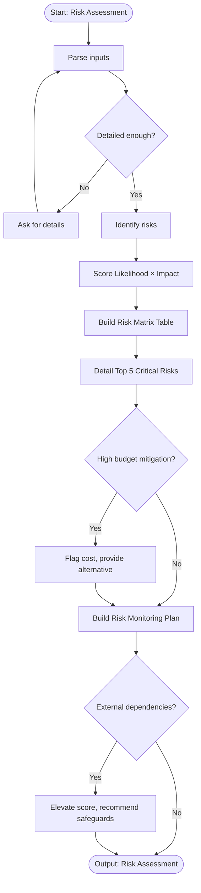

# Skill: Risk Assessment

## Purpose
Identifies and categorizes technical, operational, and business project risks. Scores risks by likelihood and impact. Provides mitigation strategies and a risk matrix to enable proactive management.

## Input
| Variable | Type | Required | Description |
|----------|------|----------|-------------|
| `{{project_description}}` | string | yes | Project goals and current state |
| `{{tech_stack}}` | string | yes | Technology stack |
| `{{timeline}}` | string | yes | Project timeline and milestones |

## Prompt
Act as a senior technical project manager performing a risk assessment.

Project description: {{project_description}}
Technology stack: {{tech_stack}}
Timeline: {{timeline}}

Produce a risk assessment document with three sections:

**1. Risk Matrix Table**
Identify ≥8 risks across Technical, Operational, and Business categories.

| Risk | Category | Likelihood (1–5) | Impact (1–5) | Risk Score | Mitigation Strategy |
|------|----------|-----------------|--------------|------------|---------------------|

Score = Likelihood × Impact (max 25).
Likelihood: 1 = Rare, 3 = Possible, 5 = Almost certain.
Impact: 1 = Negligible, 3 = Significant, 5 = Project-threatening.

Sort descending by Risk Score.

**2. Top 5 Critical Risks**
Detail the 5 highest-scoring risks:
- Risk name and category
- Root cause
- Early warning signs
- Mitigation actions
- Contingency plans
- Owner

**3. Risk Monitoring Plan**
Define:
- Review cadence
- Escalation criteria
- Risk register update process
- Key metrics

If inputs lack detail, request clarification before proceeding.

## Examples

@examples/input.md
@examples/output.md

## Edge Cases
1. **Greenfield project**: Generate assessment based on common risks for tech stack; label "assumed" pending details.
2. **Budget-heavy mitigation**: Flag cost implications; provide lower-cost alternatives.
3. **External dependencies**: Elevate risk scores; recommend SLAs, fallbacks, or data validation.

## Output Format
Three labeled sections. Section 1: markdown table sorted by score. Section 2: structured prose blocks. Section 3: bullet lists. 500–900 words.

## Senior Review Checklist
1. Is this solution the simplest that could work?
2. What are the failure modes and how are they handled?
3. How does this scale to 10x load or 10x codebase size?
4. Are there security implications that need to be addressed?
5. Is the output testable and observable in production?

## Changelog
| Version | Date | Description |
|---------|------|-------------|
| 1.1.0 | 2026-03-20 | Restructured: moved examples, references, added fields |
| 1.0.0 | 2026-03-20 | Initial release |

## MCP Dependencies
- `@modelcontextprotocol/server-sequential-thinking`
- `@modelcontextprotocol/server-memory`

## Output Path
Save generated documents to:
```
.agents/documents/tasks/backlog/{feature-slug}.md
```

## Mermaid Diagram

