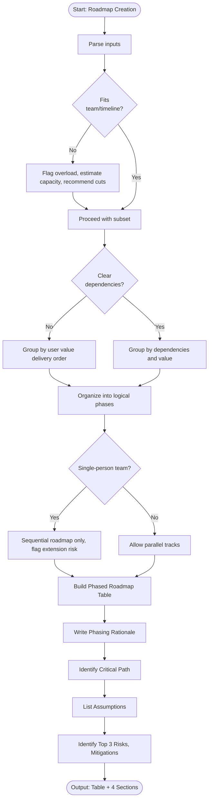

# Skill: Roadmap Creation

## Purpose
Generate structured, phased product roadmaps from feature lists, timelines, and team sizes. Organize features into logical phases with milestones, deliverables, dependencies, and success criteria. Output suitable for sharing with stakeholders.

## Input
| Variable | Type | Required | Description |
|----------|------|----------|-------------|
| `{{product_name}}` | string | yes | Name of product/project |
| `{{feature_list}}` | string | yes | Comma-separated or bulleted feature list |
| `{{timeline}}` | string | yes | Total available timeline (e.g., "6 months") |
| `{{team_size}}` | string | yes | Team composition (e.g., "3 engineers") |

## Prompt
You are a senior product manager creating a phased roadmap.

Product: {{product_name}}
Features: {{feature_list}}
Timeline: {{timeline}}
Team size: {{team_size}}

Organize features into logical phases delivering incremental value. Ensure phases are completable within timeline and achievable by team.

Produce phased roadmap table:

| Phase | Milestone | Deliverables | Timeline | Dependencies | Success Criteria |

After table, provide:

**Phasing Rationale**: Explain feature grouping decisions (dependencies, user value, risk reduction).

**Critical Path**: Identify sequence of phases/features determining earliest completion date.

**Assumptions**: List key assumptions about team velocity, feature complexity, external dependencies.

**Risks**: Identify top 3 timeline slippage risks and suggest mitigation strategies.

Flag feature lists exceeding timeline/capacity, suggest deferrals/cuts.

## Examples

@examples/input.md
@examples/output.md

## Edge Cases
1. **Feature list exceeds capacity**: Flag overload, estimate capacity, recommend cut list.
2. **No clear dependencies**: Group by user value delivery order (core loop first), explain rationale.
3. **Single-person team**: Produce sequential roadmap (no parallel work), reduce phase scope, flag timeline extension risk.

## Output Format
Phased roadmap table (6 columns) and 4 prose sections (Phasing Rationale, Critical Path, Assumptions, Risks). Total: 400–700 words.

## Senior Review Checklist
1. Simplest solution?
2. Failure modes handled?
3. Scales to 10x?
4. Security implications addressed?
5. Testable/observable in production?

## Changelog
| Version | Date | Description |
|---------|------|-------------|
| 1.1.0 | 2026-03-20 | Restructured: moved examples, references, added metadata |
| 1.0.0 | 2026-03-20 | Initial release |

## MCP Dependencies

- `@modelcontextprotocol/server-sequential-thinking` — Multi-step reasoning
- `@modelcontextprotocol/server-memory` — Knowledge graph memory

## Output Path
```
.agents/documents/tasks/roadmap/roadmap.md
```

## Mermaid Diagram

