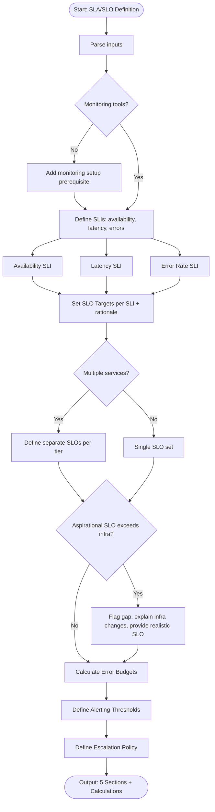

# Skill: SLA/SLO Definition

## Purpose
Define Service Level Indicators (SLIs), Service Level Objectives (SLOs), Service Level Agreements (SLAs), error budgets, alerting thresholds, and escalation policies. Align technical metrics with business expectations for data-driven incident response.

## Input
| Variable | Type | Required | Description |
|----------|------|----------|-------------|
| `{{service_description}}` | string | yes | Service description, critical user journeys |
| `{{tech_stack}}` | string | yes | Tech stack, monitoring tools (e.g., "Node.js + Datadog") |
| `{{business_requirements}}` | string | yes | Business reliability requirements (e.g., "99.9% uptime") |

## Prompt
You are a senior Site Reliability Engineer defining reliability targets.

Service: {{service_description}}
Tech stack: {{tech_stack}}
Business requirements: {{business_requirements}}

Produce complete SLA/SLO definition document with 5 sections:

**1. SLI Definitions**
Define SLIs for availability, latency, and error rate. For each:
- SLI name
- What it measures
- Measurement method (e.g., "% of 2xx requests")
- Data source (tool/system)

**2. SLO Targets**
Define target per SLI. Present as table:

| SLI | SLO Target | Measurement Window | Rationale |
|-----|-----------|-------------------|-----------|

Include:
- Availability (e.g., 99.9%)
- Latency (e.g., p95 < 500ms, p99 < 1000ms)
- Error rate (e.g., < 0.1% 5xx)
Explain rationale.

**3. Error Budget Calculation**
Calculate for each SLO:
- Monthly error budget (minutes/requests allowed)
- Weekly error budget
- Error budget burn rate (1h, 6h, 24h depletion rates)
Show calculations.

**4. Alerting Thresholds**
Define rules based on burn rates:
- Alert name
- Condition (burn rate threshold, time window)
- Severity (Page / Ticket)
- Rationale
Use multi-window, multi-burn-rate approach (fast burn: 1h, slow burn: 6h).

**5. Escalation Policy**
Define escalation chain:
- On-call rotation
- Escalation path (time-based)
- Stakeholder notification
- SLA breach notification
- Post-incident requirements

Flag unachievable business requirements, recommend realistic targets and infrastructure changes needed.

## Examples

@examples/input.md
@examples/output.md

## Edge Cases
1. **Aspirational SLO exceeds infra capability**: Flag gap, explain needed infra changes (multi-AZ, redundancy), provide realistic SLO.
2. **No monitoring infra**: Include monitoring setup recommendation as prerequisite section.
3. **Multiple services**: Define separate SLOs per service tier (critical path vs background jobs).

## Output Format
5 sections. Section 2 uses table. Sections 1, 3, 4, 5 use prose, bullet lists, explicit calculations. Total: 600–1000 words.

## Senior Review Checklist
1. Simplest solution?
2. Failure modes handled?
3. Scales to 10x?
4. Security implications addressed?
5. Testable/observable in production?

## Changelog
| Version | Date | Description |
|---------|------|-------------|
| 1.1.0 | 2026-03-20 | Restructured: moved examples, references, added metadata |
| 1.0.0 | 2026-03-20 | Initial release |

## MCP Dependencies

- `@modelcontextprotocol/server-sequential-thinking` — Multi-step reasoning

## Output Path
```
.agents/documents/design/architecture/
```

## Mermaid Diagram

