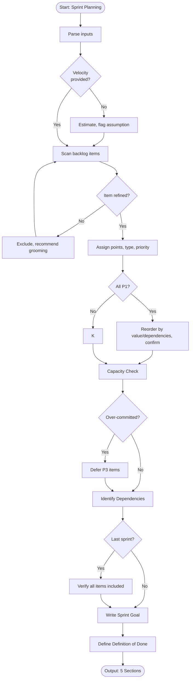

# Skill: Sprint Planning

## Purpose
Transform refined backlog items into a structured sprint plan. Assign story points, order tasks by priority, check capacity, identify dependencies, and define sprint goals and definition of done. Provide clear, executable sprint plans.

## Input
| Variable | Type | Required | Description |
|----------|------|----------|-------------|
| `{{backlog_items}}` | string | yes | Refined backlog items (stories, bugs, tech debt) |
| `{{sprint_number}}` | string | yes | Sprint number (e.g., "1") |
| `{{total_sprints}}` | string | yes | Total sprints in MVP plan |
| `{{sprint_duration}}` | string | yes | Sprint length (e.g., "2 weeks") |
| `{{team_velocity}}` | string | yes | Team velocity and composition (e.g., "40 points/sprint, 3 engineers") |

## Prompt
You are a senior scrum master planning sprints for an MVP.

Context:
- Sprint: {{sprint_number}} of {{total_sprints}}
- Duration: {{sprint_duration}}
- Team velocity: {{team_velocity}}
- Backlog items: {{backlog_items}}

**IMPORTANT:** You are planning Sprint {{sprint_number}} of {{total_sprints}}. Every item must be assigned to exactly one sprint. Do NOT leave items unassigned. If last sprint, verify all remaining items are included.

Produce 5 sections:

**1. Sprint Goal**
Write a single, outcome-focused, achievable sprint goal.

**2. Task Breakdown with Story Points**
For each item:

| # | Item | Type | Story Points | Priority | Assignee Suggestion | Notes |
|---|------|------|-------------|----------|---------------------|-------|

Points: 1, 2, 3, 5, 8, 13 (split).
Types: Feature, Bug, Tech Debt, Spike.
Priority: P1 (must), P2 (should), P3 (nice-to-have).

**3. Capacity Check**
Calculate:
- Total points
- Velocity
- Buffer (10–15%)
- Verdict: Over-committed / On-target / Under-committed
- If over-committed: defer P3 items.

**4. Dependencies**
List dependencies:
- Internal: Item A blocks B
- External: Team/third-party input
- Blocking: Prevents start

**5. Definition of Done**
Produce checklist: code reviewed, tests passing, staging verification, docs updated, PO acceptance, no critical bugs.

Flag unrefined items (missing AC or 13+ points) for grooming.

If `{{sprint_number}}` < `{{total_sprints}}`, state: "Sprint {{sprint_number}} complete. Remaining items must be planned in Sprints {{sprint_number + 1}} through {{total_sprints}}. Proceed to Sprint {{sprint_number + 1}}?" Do NOT stop here.

## Examples

@examples/input.md
@examples/output.md

## Edge Cases
1. **Unrefined items**: Flag as not sprint-ready, exclude, recommend backlog grooming.
2. **Missing team velocity**: Estimate (5 pts/engineer/week), flag as assumption.
3. **All P1 items**: Order by business value/dependencies, ask for confirmation.

## Output Format
5 sections. Section 2 uses table. Sections 1, 3, 4, 5 use prose and lists. Total: 400–700 words.

## Senior Review Checklist
1. Simplest solution?
2. Failure modes handled?
3. Scales to 10x?
4. Security implications addressed?
5. Testable/observable in production?

## Changelog
| Version | Date | Description |
|---------|------|-------------|
| 1.1.0 | 2026-03-20 | Restructured: moved examples, references, added metadata |
| 1.0.0 | 2026-03-20 | Initial release |

## MCP Dependencies

- `@modelcontextprotocol/server-sequential-thinking` — Multi-step reasoning
- `@modelcontextprotocol/server-memory` — Knowledge graph memory

## Output Path
```
.agents/documents/tasks/sprints/sprint-{N}.md
```

## Mermaid Diagram

