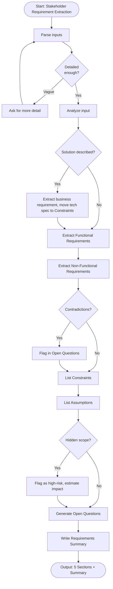

# Skill: Stakeholder Requirement Extraction

## Purpose
Convert informal stakeholder inputs (notes, emails, briefs) into structured technical requirements. Produce functional requirements, non-functional requirements, constraints, assumptions, and open questions to bridge business intent and technical specifications.

## Input
| Variable | Type | Required | Description |
|----------|------|----------|-------------|
| `{{stakeholder_description}}` | string | yes | Raw stakeholder input (paste as-is) |
| `{{context}}` | string | yes | Background context (system, product type) |
| `{{constraints}}` | string | yes | Known hard constraints (budget, timeline, tech) |

## Prompt
You are a senior business analyst extracting structured requirements from stakeholder input.

Stakeholder input: {{stakeholder_description}}
Context: {{context}}
Constraints: {{constraints}}

Analyze input and produce structured requirements. Do NOT add unimplied requirements. Do NOT remove implied requirements.

Produce 5 sections:

**1. Functional Requirements (Numbered)**
For each requirement:
- FR-[N]: [Statement in "The system shall..."]
- Source: Quote/paraphrase from input
- Priority: Must Have / Should Have / Nice to Have

**2. Non-Functional Requirements**
Cover: Performance, Security, Reliability, Usability, Scalability.
For each NFR:
- NFR-[N]: [Statement]
- Category: [Performance/Security/Reliability/Usability/Scalability]
- Source/inference basis

**3. Constraints**
List limitations:
- Technical: technologies, platforms, integrations
- Business: budget, timeline, compliance
- Organizational: team size, skills, systems

**4. Assumptions**
List inferred assumptions:
- Assumption-[N]: [Assumption]
- Basis: Why inferred
- Risk if wrong: Consequence of error

**5. Open Questions for Stakeholder**
List blocking questions:
- Q[N]: [Question]
- Why it matters: Impact on design
- Urgency: Blocking / Important / Clarifying

After sections, provide **Requirements Summary**: 3–5 sentences summarizing system purpose for stakeholder confirmation.

If input is too vague, ask for detail. Do NOT invent requirements.

## Examples

@examples/input.md
@examples/output.md

## Edge Cases
1. **Contradictory requirements**: Flag contradiction in Open Questions, ask stakeholder to prioritize.
2. **Hidden scope**: Flag high-risk open questions (e.g., unspecified ERP integration), ask for specifics before estimating.
3. **Solution described instead of requirement**: Extract underlying business requirement, list technical specs as constraints.

## Output Format
5 labeled sections with numbered items. Followed by Requirements Summary. Total: 500–900 words.

## Senior Review Checklist
1. Simplest solution?
2. Failure modes handled?
3. Scales to 10x?
4. Security implications addressed?
5. Testable/observable in production?

## Changelog
| Version | Date | Description |
|---------|------|-------------|
| 1.1.0 | 2026-03-20 | Restructured: moved examples, references, added metadata |
| 1.0.0 | 2026-03-20 | Initial release |

## MCP Dependencies

- `@modelcontextprotocol/server-sequential-thinking` — Multi-step reasoning

## Output Path
```
.agents/documents/requirements/user-stories/{feature-slug}.md
```

## Mermaid Diagram

